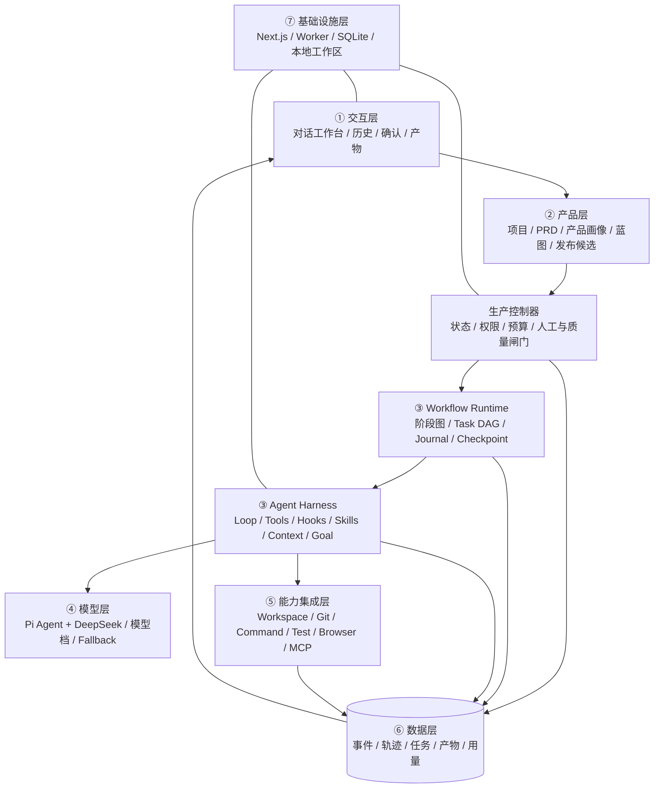

# AI 产品工厂｜总体架构 V0.2

> 状态：总体方向、正式 PRD 和 G2–G4 已确认；本文件作为架构基础，正式 G5 审批产物见 `docs/16-AI产品工厂-七层架构与产品生产蓝图.md`。

## 1. 架构结论

第一版采用“本地优先确定性控制平面 + 本机 Agent Harness 执行平面”的模块化单体。架构按 Agent Blueprint 的七层体系表达：



Web 请求只负责下达命令和读取快照，不承载长时间 Agent 执行。Worker 通过持久化队列领取生产工作流，Harness 把模型决策、工具请求和结果转换为生产事件；Workflow journal、Task DAG 和检查点保证页面刷新或进程重启后能够恢复。

这是一套混合架构：固定的产品生命周期由代码编排，阶段内需要根据真实文件、错误和工具结果动态决定的动作由模型完成。生产控制器不是“超级 Agent”，工厂 Agent 也不是状态机。

## 2. 技术基线

| 层 | 第一版选择 | 原因 |
| --- | --- | --- |
| WebUI | Next.js + TypeScript | 与三份手册一致，适合控制台与事件流界面 |
| Worker | Node.js + TypeScript | Pi Agent 官方包运行在 Node.js，减少跨语言桥接 |
| Agent Runtime | `@earendil-works/pi-agent-core@0.84.2` | 提供状态 Agent、工具调用、钩子和事件流 |
| 模型接入 | `@earendil-works/pi-ai@0.84.2` + DeepSeek | 原生支持 DeepSeek 和自定义兼容接口 |
| 工厂元数据 | SQLite | 单用户本地场景足够，事务和恢复简单 |
| 产品产物 | 项目工作区文件 + Git | 代码、文档和 diff 可直接检查、恢复和交接 |
| 进程通信 | SQLite 队列 + SSE | 第一版无需引入 Redis；SSE 用于 WebUI 实时观察 |
| 浏览器验收 | Playwright | 可重复验证小游戏和其他 Web 产品闭环 |

Agent Harness 的 V0.2 最小组件为：Agent Loop、工具注册表、权限管线、Hooks、Todo、按需 Skill、上下文压缩、持久 Task、后台任务、集成 Harness、Workflow Runtime 和 Goal Gate。Subagent、跨项目 Memory、Cron、Agent Teams 与 MCP 不为了完整而预装，只有真实需求触发后才进入。

工厂自己的 SQLite 只存生产档案、事件和索引，不替代被生产产品自己的数据方案。

小游戏、SaaS、Agent 应用等产品差异不能写成散落在生产控制器中的条件分支。生产控制器只执行生产蓝图；蓝图编译器根据产品画像选择阶段、工位、能力包和闸门。

## 3. 深模块与接口

### 3.1 生产控制器模块

这是系统最核心的深模块。调用者只需学习少量接口，阶段流转、并发限制、检查点、人工闸门和失败恢复都隐藏在模块内部。

```ts
interface ProductionController {
  start(projectId: ProjectId): Promise<RunSnapshot>;
  pause(runId: RunId): Promise<RunSnapshot>;
  resume(runId: RunId): Promise<RunSnapshot>;
  decide(gateId: GateId, decision: GateDecision): Promise<RunSnapshot>;
  cancel(runId: RunId): Promise<RunSnapshot>;
  snapshot(runId: RunId): Promise<RunSnapshot>;
}
```

调用者不能直接修改阶段字段。所有状态变化必须通过生产控制器并产生生产事件。

生产控制器只拥有生命周期与约束，不决定阶段内每一次工具调用。它向 Workflow Runtime 发出经过确认的运行命令，并根据 Workflow、Harness、人工闸门和质量闸门事件推进状态。

### 3.2 生产蓝图编译器模块

```ts
interface BlueprintCompiler {
  compile(profile: ProductProfile): Promise<ProductionBlueprint>;
  validate(blueprint: ProductionBlueprint): Promise<BlueprintValidation>;
}
```

编译器输入产品事实，不只依赖“这是游戏”或“这是 SaaS”这种单一标签。例如，同为游戏产品，有无实时联网、账号存档、AI NPC 和付费会触发完全不同的能力包。

所有项目先继承通用基础工位，再按需求组合能力包：

- Agent 与模型调用；
- RAG 与知识库；
- 图片、音频和视频；
- 游戏体验与帧循环；
- 实时协作或实时通信；
- 账户、权限和多租户；
- 交易和高风险外部动作；
- 不同终端与部署目标。

新增能力包不改变生产控制器接口。测试至少提供“小游戏”和“非游戏 Web 工具”两种产品画像，避免通用性只停留在设计上。

### 3.3 Workflow Runtime 模块

```ts
interface WorkflowRuntime {
  start(definition: WorkflowDefinition, input: WorkflowInput): Promise<WorkflowRun>;
  resume(runId: WorkflowRunId): Promise<WorkflowRun>;
  pause(runId: WorkflowRunId): Promise<void>;
  cancel(runId: WorkflowRunId): Promise<void>;
  events(runId: WorkflowRunId): AsyncIterable<WorkflowEvent>;
}
```

Workflow Definition 由宿主注册并版本化，模型只能选择已注册工作流和提供结构化参数，不能提交可执行编排代码。运行时负责阶段、Task DAG、结构化子结果、journal、稳定调用键和断点续跑。

### 3.4 Agent Harness 与 Agent Runtime 模块

Agent Runtime 的接缝隔离具体 Agent SDK。第一版只有一个生产适配器 Pi Agent，测试使用内存适配器，因此这个接缝是真实存在的。

```ts
interface AgentRuntime {
  run(assignment: AgentAssignment): AsyncIterable<AgentEvent>;
  steer(runId: RunId, message: string): Promise<void>;
  abort(runId: RunId): Promise<void>;
}
```

`PiAgentAdapter` 负责：

- 把完成目标和生产单转换为 system prompt、受保护知识上下文和工具集合；
- 使用 DeepSeek 模型配置创建 Agent；
- 将 Pi Agent 事件转换成统一生产事件；
- 运行连续 Agent Loop，直到请求工具、Goal Gate 放行或控制器终止；
- 在 `PreToolUse` Hooks 执行权限预检和审计；
- 在 `PostToolUse` Hooks 登记结果、观察和产物；
- 控制最大轮数、Token、费用、超时、重试和上下文压缩。

Harness 内部保持单一循环，工具、权限、审计、上下文、任务和目标判断作为深模块接入，不为每个工位复制一套循环。

### 3.5 工具网关模块

Pi Agent 不能直接获得不受控的 Shell 和文件系统能力。所有工具调用经过统一网关：

```ts
interface ToolGateway {
  execute(request: ToolRequest, policy: ToolPolicy): Promise<ToolResult>;
}
```

第一版工具组：

- `workspace.read`：读取允许工作区内文件；
- `workspace.write`：创建或修改允许工作区内文件；
- `workspace.search`：文件和文本搜索；
- `command.run`：执行白名单或策略允许的命令；
- `git.inspect`：状态、diff、历史等只读操作；
- `test.run`：运行测试、Lint、类型检查和构建；
- `browser.inspect`：启动并检查本地 Web 产品；
- `artifact.register`：登记产物；
- `gate.request`：请求人工闸门；
- `stage.report`：提交工位完成报告。

高风险命令、工作区外写入、部署、删除、推送和外部发送必须被阻止或转为人工闸门。

### 3.6 手册权威上下文模块

```ts
interface ManualAuthority {
  verify(): Promise<ManualVerification>;
  loadForStage(stage: StageName): Promise<ProtectedManualContext>;
}
```

`ManualAuthority` 从内部原始路径读取手册，不保存公开副本。每次运行先校验 SHA256；按阶段完整读取对应原文，跨阶段读取三份。原文上下文不可被摘要替代或被普通上下文压缩删除；生产事件只记录名称、哈希、适用阶段和加载结果。

### 3.7 生产档案模块

```ts
interface ProductionRecordStore {
  append(event: ProductionEvent): Promise<void>;
  load(runId: RunId): Promise<RunSnapshot>;
  listArtifacts(projectId: ProjectId): Promise<Artifact[]>;
  claimNextWork(workerId: WorkerId): Promise<WorkOrder | null>;
}
```

事件采用只追加记录，`RunSnapshot` 由事件重建或缓存投影得到。聊天消息可以作为证据保存，但不能代替生产事件、Workflow journal、任务状态和结构化质量证据。

## 4. 核心状态机

### 4.1 生产批次状态

```text
draft
→ ready
→ running
↔ paused
→ waiting_input | waiting_approval
→ verifying
→ succeeded

任意运行态 → failed | cancelled
failed → ready（用户重试或恢复后）
```

关键约束：

- 同一产品项目第一版最多一个写入中的生产批次；
- `waiting_approval` 未收到有效决定不能继续；
- `succeeded` 只表示本批次目标完成，不自动等于“已上线”；
- Worker 异常退出后，超时租约被回收，批次回到可恢复状态；
- 每次工位结束、人工闸门决定和质量闸门结果都生成检查点。

### 4.2 Workflow 与任务状态

```text
Workflow: pending → running ↔ paused → verifying → passed
                         ↘ blocked | failed | cancelled

Task: pending → in_progress → completed
                 ↘ blocked | failed → ready_for_retry
```

模型不再调用工具只表示当前 Agent turn 希望停止。存在完成目标时，必须进入 `verifying`，由 Goal Gate 根据已登记的测试、构建、浏览器或人工证据决定 `passed`、继续执行或交还用户。

## 5. DeepSeek 与 Pi Agent 的组合

模型配置属于运行时配置，不写进工位 Prompt：

```ts
type ModelProfile = {
  provider: "deepseek";
  model: string;
  thinkingLevel: "off" | "low" | "medium" | "high";
  maxTokens: number;
  maxCostCny?: number;
  timeoutMs: number;
};
```

第一版允许不同工位引用不同配置档：

- `planning`：需求分析、技术适配和复杂故障推理；
- `execution`：常规编码、文档和修改；
- `review`：独立检查规格、变更与质量证据。

三个档位都可以先使用 DeepSeek，只调整模型和预算。将来更换模型只需要新增模型适配器或配置，不改变生产控制器。

## 6. 数据与文件布局

建议实现阶段采用一个 monorepo：

```text
ai-product-factory/
├── apps/
│   ├── web/                 # Web 控制台
│   └── worker/              # Pi Agent 与工具执行进程
├── packages/
│   ├── production/          # 生产控制器与状态机
│   ├── blueprints/          # 产品画像、蓝图编译器与能力包
│   ├── workflows/           # Workflow 定义、Task DAG、journal 与恢复
│   ├── agent-runtime/       # Agent Harness、Runtime 接口与 Pi 适配器
│   ├── tool-gateway/        # 工具权限和执行
│   ├── manual-authority/    # 三份内部手册的校验与受保护加载
│   ├── records/             # SQLite 事件与投影
│   ├── station-contracts/   # 工位及生产单 schema
│   └── shared/              # 共享类型和错误结构
├── stations/                # 版本化工位说明和模板
├── capability-packs/        # 可组合的产品专属生产能力
├── data/                    # 本地数据库，禁止提交
└── tests/
```

被生产的小游戏和后续产品放在工厂仓库之外的独立工作区，工厂只保存路径、索引和生产证据。

## 7. 安全与控制

- `DEEPSEEK_API_KEY` 只由 Worker 读取，不进入浏览器、数据库事件、日志或 Agent 消息。
- 工作区使用解析后的绝对路径校验，禁止路径穿越和默认写到工作区外。
- Shell 使用命令策略和风险分级；不使用字符串黑名单冒充安全沙箱。
- 读取现有项目时先检查 Git 和未提交修改，默认保留用户内容。
- 所有工具调用记录工具名、参数摘要、时间、结果和关联生产单，敏感值脱敏。
- 工厂 Agent 只能调用注册工具；工具描述、模型输出和 MCP 提示都不能自行授予权限。
- 三份原始手册上下文与普通会话历史分离，压缩只处理可恢复的工具结果和会话历史。
- 发布、付费、删除、推送、外部消息和权限扩张必须经过人工闸门。
- WebUI 的“取消”区分停止 Agent、停止等待和取消外部任务，不做虚假承诺。

## 8. 测试策略

- 生产控制器：状态机性质测试、并发和崩溃恢复测试。
- Agent Runtime：使用内存适配器验证事件序列、steer 和 abort；Pi 适配器做真实 DeepSeek 冒烟。
- Agent Harness：验证多轮工具循环、每个 tool call/result 配对、Hooks 顺序、预算退出和 Goal Gate 继续条件。
- Workflow Runtime：验证任务依赖、journal 原子写入、稳定调用键、暂停/恢复和重复副作用保护。
- ManualAuthority：验证哈希失败即阻塞、阶段映射、原文完整加载和上下文压缩保护。
- 工具网关：工作区逃逸、危险命令、超时、输出截断和审批策略测试。
- 生产档案：事件追加、投影重建、幂等和租约回收测试。
- WebUI：页面状态矩阵、SSE 断线恢复、人工闸门和产物查看测试。
- 端到端：用小游戏 PRD 跑通至少一条“导入 → 生产 → 失败恢复 → 浏览器验收 → 发布候选”路径。
- 通用性：同一生产控制器分别执行游戏和非游戏蓝图；断言核心事件和状态模型中没有产品专属字段。

## 9. 后续演进路径

第一版稳定后，才评估：

1. 把 SQLite 队列替换为真正的任务队列；
2. 把本机 Worker 扩展为远程隔离 Worker；
3. 增加用户、组织和权限；
4. 在单写入 Agent 稳定后，支持一次性 Subagent 和基于 worktree 的 Agent Teams；
5. 建立产品模板与跨项目知识库；
6. 接入多模型路由和成本优化。

这些变化都不应修改生产控制器的外部接口，只替换内部适配器或增加受控能力。
