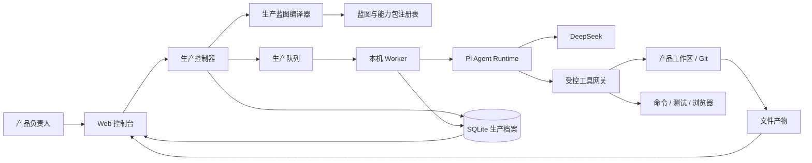

# AI 产品工厂｜总体架构 V0.1

## 1. 架构结论

第一版采用“本地优先控制平面 + 本机生产 Worker”的模块化单体：



Web 请求只负责下达命令和读取快照，不承载长时间 Agent 执行。Worker 通过持久化队列领取生产单，并把生产事件持续写回生产档案，因此页面刷新和进程重启不会把任务状态抹掉。

## 2. 技术基线

| 层 | 第一版选择 | 原因 |
| --- | --- | --- |
| WebUI | Next.js + TypeScript | 与三份手册一致，适合控制台与事件流界面 |
| Worker | Node.js + TypeScript | Pi Agent 官方包运行在 Node.js，减少跨语言桥接 |
| Agent Runtime | `@earendil-works/pi-agent-core@0.84.2` | 提供状态 Agent、工具调用、钩子和事件流 |
| 模型接入 | `@earendil-works/pi-ai@0.84.2` + DeepSeek | 原生支持 DeepSeek 和自定义兼容接口 |
| 工厂元数据 | SQLite | 单用户本地场景足够，事务和恢复简单 |
| 产品产物 | 项目工作区文件 + Git | 代码、文档和 diff 可直接检查、恢复和交接 |
| 进程通信 | SQLite 队列 + SSE | 第一版无需引入 Redis；SSE 用于 WebUI 实时观察 |
| 浏览器验收 | Playwright | 可重复验证小游戏和其他 Web 产品闭环 |

工厂自己的 SQLite 只存生产档案、事件和索引，不替代被生产产品自己的数据方案。

小游戏、SaaS、Agent 应用等产品差异不能写成散落在生产控制器中的条件分支。生产控制器只执行生产蓝图；蓝图编译器根据产品画像选择阶段、工位、能力包和闸门。

## 3. 深模块与接口

### 3.1 生产控制器模块

这是系统最核心的深模块。调用者只需学习少量接口，阶段流转、并发限制、检查点、人工闸门和失败恢复都隐藏在模块内部。

```ts
interface ProductionController {
  start(projectId: ProjectId): Promise<RunSnapshot>;
  pause(runId: RunId): Promise<RunSnapshot>;
  resume(runId: RunId): Promise<RunSnapshot>;
  decide(gateId: GateId, decision: GateDecision): Promise<RunSnapshot>;
  cancel(runId: RunId): Promise<RunSnapshot>;
  snapshot(runId: RunId): Promise<RunSnapshot>;
}
```

调用者不能直接修改阶段字段。所有状态变化必须通过生产控制器并产生生产事件。

### 3.2 生产蓝图编译器模块

```ts
interface BlueprintCompiler {
  compile(profile: ProductProfile): Promise<ProductionBlueprint>;
  validate(blueprint: ProductionBlueprint): Promise<BlueprintValidation>;
}
```

编译器输入产品事实，不只依赖“这是游戏”或“这是 SaaS”这种单一标签。例如，同为游戏产品，有无实时联网、账号存档、AI NPC 和付费会触发完全不同的能力包。

所有项目先继承通用基础工位，再按需求组合能力包：

- Agent 与模型调用；
- RAG 与知识库；
- 图片、音频和视频；
- 游戏体验与帧循环；
- 实时协作或实时通信；
- 账户、权限和多租户；
- 交易和高风险外部动作；
- 不同终端与部署目标。

新增能力包不改变生产控制器接口。测试至少提供“小游戏”和“非游戏 Web 工具”两种产品画像，避免通用性只停留在设计上。

### 3.3 Agent Runtime 模块

Agent Runtime 的接缝隔离具体 Agent SDK。第一版只有一个生产适配器 Pi Agent，测试使用内存适配器，因此这个接缝是真实存在的。

```ts
interface AgentRuntime {
  run(assignment: AgentAssignment): AsyncIterable<AgentEvent>;
  steer(runId: RunId, message: string): Promise<void>;
  abort(runId: RunId): Promise<void>;
}
```

`PiAgentAdapter` 负责：

- 把生产单转换为 system prompt、上下文和工具集合；
- 使用 DeepSeek 模型配置创建 Agent；
- 将 Pi Agent 事件转换成统一生产事件；
- 在 `beforeToolCall` 执行权限预检；
- 在 `afterToolCall` 登记结果和产物；
- 控制最大轮数、Token、费用、超时和上下文压缩。

### 3.4 工具网关模块

Pi Agent 不能直接获得不受控的 Shell 和文件系统能力。所有工具调用经过统一网关：

```ts
interface ToolGateway {
  execute(request: ToolRequest, policy: ToolPolicy): Promise<ToolResult>;
}
```

第一版工具组：

- `workspace.read`：读取允许工作区内文件；
- `workspace.write`：创建或修改允许工作区内文件；
- `workspace.search`：文件和文本搜索；
- `command.run`：执行白名单或策略允许的命令；
- `git.inspect`：状态、diff、历史等只读操作；
- `test.run`：运行测试、Lint、类型检查和构建；
- `browser.inspect`：启动并检查本地 Web 产品；
- `artifact.register`：登记产物；
- `gate.request`：请求人工闸门；
- `stage.report`：提交工位完成报告。

高风险命令、工作区外写入、部署、删除、推送和外部发送必须被阻止或转为人工闸门。

### 3.5 生产档案模块

```ts
interface ProductionRecordStore {
  append(event: ProductionEvent): Promise<void>;
  load(runId: RunId): Promise<RunSnapshot>;
  listArtifacts(projectId: ProjectId): Promise<Artifact[]>;
  claimNextWork(workerId: WorkerId): Promise<WorkOrder | null>;
}
```

事件采用只追加记录，`RunSnapshot` 由事件重建或缓存投影得到。聊天消息可以作为证据保存，但不能代替生产事件和结构化状态。

## 4. 核心状态机

### 4.1 生产批次状态

```text
draft
→ ready
→ running
↔ paused
→ waiting_input | waiting_approval
→ verifying
→ succeeded

任意运行态 → failed | cancelled
failed → ready（用户重试或恢复后）
```

关键约束：

- 同一产品项目第一版最多一个写入中的生产批次；
- `waiting_approval` 未收到有效决定不能继续；
- `succeeded` 只表示本批次目标完成，不自动等于“已上线”；
- Worker 异常退出后，超时租约被回收，批次回到可恢复状态；
- 每次工位结束、人工闸门决定和质量闸门结果都生成检查点。

### 4.2 工位执行状态

```text
pending → running → reporting → verifying → passed
                    ↘ blocked
                    ↘ failed → retrying
                    ↘ cancelled
```

## 5. DeepSeek 与 Pi Agent 的组合

模型配置属于运行时配置，不写进工位 Prompt：

```ts
type ModelProfile = {
  provider: "deepseek";
  model: string;
  thinkingLevel: "off" | "low" | "medium" | "high";
  maxTokens: number;
  maxCostCny?: number;
  timeoutMs: number;
};
```

第一版允许不同工位引用不同配置档：

- `planning`：需求分析、技术适配和复杂故障推理；
- `execution`：常规编码、文档和修改；
- `review`：独立检查规格、变更与质量证据。

三个档位都可以先使用 DeepSeek，只调整模型和预算。将来更换模型只需要新增模型适配器或配置，不改变生产控制器。

## 6. 数据与文件布局

建议实现阶段采用一个 monorepo：

```text
ai-product-factory/
├── apps/
│   ├── web/                 # Web 控制台
│   └── worker/              # Pi Agent 与工具执行进程
├── packages/
│   ├── production/          # 生产控制器与状态机
│   ├── blueprints/          # 产品画像、蓝图编译器与能力包
│   ├── agent-runtime/       # Agent Runtime 接口与 Pi 适配器
│   ├── tool-gateway/        # 工具权限和执行
│   ├── records/             # SQLite 事件与投影
│   ├── station-contracts/   # 工位及生产单 schema
│   └── shared/              # 共享类型和错误结构
├── stations/                # 版本化工位说明和模板
├── capability-packs/        # 可组合的产品专属生产能力
├── data/                    # 本地数据库，禁止提交
└── tests/
```

被生产的小游戏和后续产品放在工厂仓库之外的独立工作区，工厂只保存路径、索引和生产证据。

## 7. 安全与控制

- `DEEPSEEK_API_KEY` 只由 Worker 读取，不进入浏览器、数据库事件、日志或 Agent 消息。
- 工作区使用解析后的绝对路径校验，禁止路径穿越和默认写到工作区外。
- Shell 使用命令策略和风险分级；不使用字符串黑名单冒充安全沙箱。
- 读取现有项目时先检查 Git 和未提交修改，默认保留用户内容。
- 所有工具调用记录工具名、参数摘要、时间、结果和关联生产单，敏感值脱敏。
- 发布、付费、删除、推送、外部消息和权限扩张必须经过人工闸门。
- WebUI 的“取消”区分停止 Agent、停止等待和取消外部任务，不做虚假承诺。

## 8. 测试策略

- 生产控制器：状态机性质测试、并发和崩溃恢复测试。
- Agent Runtime：使用内存适配器验证事件序列、steer 和 abort；Pi 适配器做真实 DeepSeek 冒烟。
- 工具网关：工作区逃逸、危险命令、超时、输出截断和审批策略测试。
- 生产档案：事件追加、投影重建、幂等和租约回收测试。
- WebUI：页面状态矩阵、SSE 断线恢复、人工闸门和产物查看测试。
- 端到端：用小游戏 PRD 跑通至少一条“导入 → 生产 → 失败恢复 → 浏览器验收 → 发布候选”路径。
- 通用性：同一生产控制器分别执行游戏和非游戏蓝图；断言核心事件和状态模型中没有产品专属字段。

## 9. 后续演进路径

第一版稳定后，才评估：

1. 把 SQLite 队列替换为真正的任务队列；
2. 把本机 Worker 扩展为远程隔离 Worker；
3. 增加用户、组织和权限；
4. 支持多个 Agent 并行工位；
5. 建立产品模板与跨项目知识库；
6. 接入多模型路由和成本优化。

这些变化都不应修改生产控制器的外部接口，只替换内部适配器或增加受控能力。
