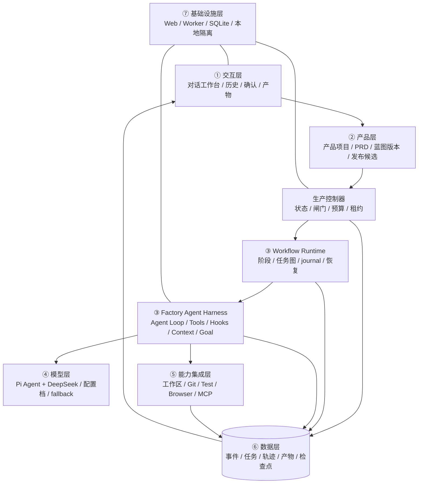

# AI 产品工厂｜Agent Harness 方向调整与技术适配声明 V0.2

> 迁移状态（2026-09-02）：本文保留为 Pi Agent + DeepSeek 时期的历史基线；其 Agent 和模型运行时结论已由 `docs/28-Codex-App-Server架构迁移技术适配声明.md` 和 `docs/29-Codex-App-Server迁移第一阶段开发文档.md` 取代，不再作为当前实现指导。
>
> 状态：方向、流程、正式 PRD 和 G2–G5 已确认。当前只生成 V0.2-B 最小 Harness 的 G6 阶段文档；G6 通过前不实施新方向的生产代码。
>
> 依据：三份原始手册、`agent-blueprint/BLUEPRINT.md` 及其 s01–s17 组件说明。三份原始手册始终拥有最高优先级，Agent Blueprint 是实现 Agent Harness 的架构参考，不能覆盖手册。

## 1. 方向结论

AI 产品工厂不再被定义为“按固定工位依次调用一次大模型的分析流水线”，而是：

> 一个由 WebUI 控制的、以 Pi Agent + DeepSeek 为驾驶者、以受控 Agent Harness 为执行载具的通用数字产品制造系统。

用户从一个对话入口说需求、补充 PRD 和确认关键决定；工厂 Agent 负责理解、规划、调用工具、修改独立产品工作区、运行验证并提交产物。确定性代码负责工作流、权限、预算、状态、检查点、人工闸门和质量闸门，模型不能自行绕过。

小游戏仍是第一台试产产品，但不是工厂的产品边界。后续可以生产 Agent 产品、内容工具、SaaS、数据工具、API 产品和其他数字产品。

## 2. 为什么必须调整

当前实现已经具备项目、生产批次、事件、人工确认和 WebUI，但 Worker 的核心仍是“一张生产单 → 一次模型回答”。它可以生成分析文本，还不能构成真正的 Agent 产品工厂，因为缺少：

- 模型可调用的受控工具和连续 Agent Loop；
- 可恢复的任务图、检查点和 Workflow journal；
- 工具前后的权限与审计 Hooks；
- 按需知识加载和受保护的上下文管理；
- 能用真实证据判断是否完成的 Goal Gate；
- 从 PRD 到领域骨架、组件选型和七层架构的标准推导结果。

因此，现阶段的前端不是要推倒重做，而是保留为控制平面；下一阶段的主线从“继续增加聊天工位”改为“建设可执行、可恢复、可验收的 Agent Harness”。

## 3. 工厂自身的 Harness 五要素

| 要素 | 工厂中的定义 |
| --- | --- |
| 工具 | 工作区读写与搜索、Git 检查、命令与测试、浏览器验收、产物登记、人工闸门请求；后续按产品需要接 MCP |
| 知识 | 三份原始手册、用户 PRD、现有代码、阶段文档、产品能力包和工具说明 |
| 观察 | 工具结果、Git diff、测试退出码、构建结果、浏览器状态、模型用量、工作流事件和人工决定 |
| 行动 | 通过受控工具修改独立产品工作区、执行命令、生成和登记产物；发布、推送、付费和外部发送必须单独授权 |
| 权限 | 工作区边界、工具白名单、参数校验、预算和轮数、风险分级、人工闸门、质量闸门与完整审计 |

## 4. 从 PRD 到产品的新主链路

```text
用户在对话框描述需求 / 上传 PRD
→ ① 需求拆解：只提取硬事实，缺失项标“待确认”
→ ② 领域建模：形成工具 / 知识 / 观察 / 行动 / 权限清单
→ ③ 组件选型：只选择本产品真正需要的 Harness 与能力包
→ ④ 架构设计：生成标准七层架构、工具清单、安全边界和部署形态
→ 产品负责人确认方案
→ ⑤ 代码生产：骨架 → 硬化 → 产品化
→ 自动质量证据 + 产品负责人真实验收
→ 发布候选
→ 发布确认后部署
```

这条链路同时满足三份手册的“技术适配声明 → 当前阶段开发文档 → 分阶段开发 → 双层验证 → 正式前端 → 部署”要求。Agent Blueprint 的五步推导嵌入手册流程，不替代手册流程。

## 5. 新总体架构：控制平面 + Harness 执行平面



关键分工：

- 生产控制器决定“能不能进入下一状态”；
- Workflow Runtime 决定“固定生产阶段怎样编排、怎样恢复”；
- Factory Agent 决定“当前阶段下一步调用什么工具”；
- Goal Gate 根据证据判断“当前目标是否真的完成”；
- 产品负责人决定产品范围、重大影响、体验效果和正式发布。

## 6. Agent Blueprint 组件选型

遵循“没有它产品会怎样”的最小选型原则，V0.2 不一次性照搬 17 个组件。

| 组件 | V0.2 | 原因 |
| --- | --- | --- |
| s01 Agent Loop | 采用 | 没有连续工具循环，工厂只能生成文本，不能完成产品生产 |
| s02 工具系统 | 采用 | 文件、Git、测试、浏览器等能力必须通过统一注册表扩展 |
| s03 权限系统 | 采用 | 工厂会写文件和执行命令，必须默认拒绝越界与高风险动作 |
| s04 Hooks | 采用 | 权限、审计、产物登记和指标不能散落在循环里 |
| s05 TodoWrite | 采用 | 单次复杂生产任务需要可见的执行计划 |
| s06 一次性 Subagent | 暂缓 | 先验证单 Factory Agent 的可靠性；需要隔离审查上下文时再启用 |
| s07 Skill Loading | 采用 | 产品能力包和领域规范按需加载，避免无关知识占满上下文 |
| s08 Context Compact | 采用 | 长任务必然产生大量工具结果；权威手册上下文不得被摘要替代 |
| s09 Memory | 暂缓 | V0.2 先保证项目内档案可恢复，跨项目自动记忆后置 |
| s10 Task System | 采用 | 生产任务需要依赖、持久化、认领和断点恢复 |
| s11 Background Tasks | 采用 | 安装、构建、测试和浏览器验收不能阻塞 Agent Loop |
| s12 Cron | 不采用 | 第一版由用户启动生产，没有定时自治需求 |
| s13 Agent Teams | 暂缓 | 先完成单 Worker、单写入者和工作区安全，再考虑并行队友与 worktree |
| s14 MCP | 按需 | 只有目标产品需要外部系统时，作为能力包接入 |
| s15 Integrated Harness | 采用 | 所有机制必须回到同一个受控循环和事件模型 |
| s16 Workflow Runtime | 采用 | 产品生产阶段是固定、可追踪、可恢复的编排，不应只存在于聊天历史 |
| s17 Goal Loop | 采用 | “模型停下”不等于“目标完成”，必须根据测试与验收证据判断 |

## 7. 三份手册的不可压缩权威通道

三份原始手册不能被复制进公开仓库，不能被摘要替代，也不能在上下文压缩时丢失。新的 Harness 必须提供独立的 `ManualAuthority`：

1. 每个新产品流程开始时先校验三份原文 SHA256；校验失败立即阻塞。
2. 校验通过后按固定顺序完整读取三份原文，锁定该流程的未压缩快照与哈希。
3. 同一流程的所有工位、返工、重试和恢复只复用该快照，不重新读取磁盘原文；内容不改写，手册消息不参与历史摘要。
4. 运行事件记录手册名称、哈希、加载时间和产品流程 ID，但不记录或公开原文。
5. 派生 Skill、索引或摘要只能用于导航，不能作为合规依据，也不能触发工位重读原文。
6. 产品流程完成或终止后释放快照且不再读取；下一个新产品流程重新校验、完整读取并锁定自己的快照。
7. 固定手册前缀优先使用模型上下文缓存，以减少延迟；缓存只改变传输成本，不改变输入内容或生命周期。

## 8. 产品类型的边界

Agent Blueprint 主要描述 Agent 产品，但工厂仍然生产各种数字产品：

- 对所有产品，Agent Blueprint 用于建设“工厂自身的执行 Harness”；
- 对目标产品本身也是 Agent 的项目，再额外用五要素和组件选型设计其产品内 Harness；
- 对小游戏、普通 Web 工具或不含运行时 AI 的产品，不强行加入 Agent、记忆、MCP 或团队能力；
- 产品差异继续由产品画像和能力包表达，不写进生产控制器核心。

## 9. WebUI 调整方向

保留现有小云雀式对话工作台，但信息层级改成四件事：

1. **说需求**：主输入框接受自然语言、PRD 和补充材料；
2. **看方案**：展示五步推导结果、唯一推荐方案和待确认项；
3. **看生产**：展示当前目标、计划、工具动作、证据、耗时和阻塞原因；
4. **做决定**：只在真实结果存在、风险需要批准或阶段验收时出现确认操作。

普通用户不需要理解“工位、事件、SSE、Token”等术语。技术细节放入默认收起的运行详情。

## 10. V0.2 实施顺序

### A. 先冻结方案

- 确认本文的方向、组件选型和七层架构；
- 更新领域语言、产品定义、总体架构和 MVP 路线；
- 不改三份原始手册。

### B. 建设最小可执行 Harness

- Agent Loop、工具注册表、Hooks 和权限管线；
- 受控工作区读写、Git 检查、命令和测试；
- 统一工具事件和产物登记；
- ManualAuthority 与受保护上下文。

### C. 建设可恢复编排

- 持久任务图、Workflow journal、检查点和后台任务；
- 暂停、继续、终止和失败恢复；
- Goal Gate 与质量证据绑定。

### D. 接通 PRD 到产品

- 五步推导的结构化 schema；
- 七层架构与组件选型产物；
- 产品负责人确认后，才生成和修改目标产品代码。

### E. 真实试产

- 用小游戏跑通完整纵向切片；
- 再用一个非游戏产品验证通用性；
- 单 Agent 可靠后再评估 Subagent、Agent Teams、Memory 和更多 MCP。

## 11. 已确认的产品决定

产品负责人已经确认以下方向：

- 产品主形态：对话式 Web 控制台；
- 核心执行：Pi Agent + DeepSeek + 自建受控 Harness；
- 编排方式：确定性 Workflow 管阶段，Agent Loop 管阶段内动作；
- 第一版：单用户、单写入 Worker、单 Factory Agent；
- 三份手册：每个新产品流程开始时完整校验、读取并锁定，流程内复用，完成或终止后释放且不再读取，下一个新产品重新读取；原文受保护、哈希留证、永不以摘要替代；
- 第一台试产：小游戏；第二台使用非游戏产品验证通用性。

本方向、流程、正式 PRD 和 G2–G5 已经确认。下一道闸门是 G6“最小可执行 Harness”阶段开工确认；G6 通过后才进入当前阶段的 Harness 代码实施。
