# AI 产品工厂｜产品需求文档 PRD V1.0

> 文档状态：G1 已确认
>
> 产品阶段：单用户本地优先 MVP
>
> 适用范围：AI 产品工厂本身，不是某一台试产产品的 PRD
>
> 最高约束：内部工作区中的三份原始手册。本文不能替代、摘要、压缩或改写原始手册。

## 1. 产品概述

### 1.1 一句话定义

AI 产品工厂是一个对话式 Web 产品制造系统：用户输入一句产品需求、一段详细描述或一份已有 PRD，工厂将其逐步转换成经过确认的标准 PRD、技术适配方案、领域骨架、组件选型、产品架构和生产计划，再由受控 Factory Agent 完成开发、验证、验收和发布准备。

### 1.2 产品愿景

让懂产品目标但不想处理大量工程细节的产品负责人，可以用自然语言控制完整产品生产过程，并且始终知道：

- 工厂现在理解了什么；
- 当前正在做什么；
- 为什么需要确认；
- 产生了什么真实结果；
- 为什么通过、失败或停止；
- 下一步需要自己做什么。

### 1.3 核心原则

1. **先 PRD，后技术方案，确认后才写代码。**
2. **一步一产物，一阶段一确认。** 没有真实产物不能出现确认按钮。
3. **手册是规则来源，用户是确认者。** 手册不“替用户确认”，Factory Agent 根据手册生成方案，由产品负责人确认。
4. **模型负责推理，确定性代码负责边界。** 状态、权限、预算、检查点和质量结果不能由模型自行宣布。
5. **产品类型开放。** 小游戏是第一台试产产品，不定义工厂能力边界。
6. **不编造需求。** 输入中没有的重要产品事实必须标记“待确认”。
7. **不把模型停下当作完成。** 完成必须有测试、构建、浏览器、产物或人工验收证据。

## 2. 背景与问题

### 2.1 用户当前面临的问题

- 一个产品想法往往只有一句话，无法直接进入可靠开发；
- 已有 PRD 的完整度和写法不统一，技术方案容易建立在遗漏或误解上；
- 普通 AI 编程过程经常一次输出大量内容，用户不知道应该确认什么；
- 方案、代码、测试和部署混在一起，范围改变后难以判断哪些结果已经失效；
- 模型可能输出空结果、提前宣布完成或忽略失败证据；
- 长任务刷新页面或 Worker 重启后容易丢失；
- 小游戏、Agent 产品、SaaS 和数据工具需要不同能力，固定模板无法通用。

### 2.2 产品要解决的问题

工厂需要把非结构化需求变成一条可控制、可恢复、可追溯的生产链路。每个重大阶段都必须先产生清晰结果，再等待产品负责人确认；确认后的结果成为下一阶段唯一有效输入。

## 3. 目标用户

### 3.1 第一版用户

- 唯一用户：产品负责人本人；
- 能说清产品想达到什么效果；
- 不需要理解框架、数据库、Agent Loop、工作流引擎等工程概念；
- 愿意在产品范围、重要方案、真实效果和发布前做决定。

### 3.2 后续用户

- 小型产品团队；
- 独立开发者或创业者；
- 企业内部产品与工程协作团队。

第一版不因为后续用户存在而提前建设多租户、团队角色和商业化账户体系。

## 4. 产品目标与成功标准

### 4.1 MVP 目标

1. 支持用户以短需求、长描述或已有 PRD 三种方式创建产品项目。
2. 生成一份结构统一、可版本化、可确认的标准 PRD。
3. PRD 确认后，按照三份原始手册生成技术适配声明。
4. 按 Agent Blueprint 依次完成领域建模、组件选型和七层架构设计。
5. 每个重大阶段独立展示产物并等待确认。
6. 方案全部确认后，Factory Agent 才能在受控工作区调用工具生产代码。
7. 生产过程能够暂停、继续、重试、终止并从检查点恢复。
8. 自动检查和真实产品验收都有可查看证据。
9. 用小游戏跑通第一条完整试产；再用非游戏产品验证通用性。

### 4.2 MVP 成功指标

- 三种输入方式都能进入同一条标准化流程；
- PRD 中所有无法从用户输入证明的重大内容均被标记为“待确认”；
- 未确认 PRD 时，系统不能进入技术适配；
- 未确认架构和当前阶段计划时，系统不能修改目标产品代码；
- 空模型结果、失败结果或尚未结束的后台任务不能触发确认闸门；
- 页面刷新或 Worker 重启后，当前阶段、待确认内容和历史决定仍然存在；
- 每个阶段能回答“输入、产物、确认结果、下一步”四个问题；
- 小游戏试产产生可运行产品、自动测试、生产构建和浏览器验收证据；
- 非游戏产品不会加载游戏专属工位、字段和验收项；
- 未经明确确认，不执行发布、付费、删除、推送或外部发送。

## 5. 第一版范围

### 5.1 第一版必须包含

- 对话式需求输入；
- Markdown、纯文本、`.docx` 和可复制文字 PDF 的 PRD 上传或粘贴；
- 原始输入保留与标准 PRD 版本化；
- PRD 生成和确认；
- 三份手册完整性校验和阶段化读取；
- 技术适配声明和确认；
- Harness 五要素领域骨架和确认；
- 组件选型和确认；
- 七层架构、生产蓝图和确认；
- 当前阶段开发文档和确认；
- Factory Agent 受控工具生产；
- Todo、持久 Task、Workflow、检查点和后台任务；
- 真实测试、构建、浏览器检查和 Goal Gate；
- 产品效果验收、发布候选和发布确认；
- 产品历史、产物、失败原因和恢复入口。

### 5.2 第一版明确不做

- 多用户、多租户和团队权限；
- 同时并行生产大量产品；
- 无人监管的自动发布或真实扣费；
- 默认启用 Agent Teams、跨项目长期 Memory 或 Cron；
- 承诺通用生产原生 App、硬件、强监管或高并发分布式产品；
- 为所有产品强行加入运行时 AI、RAG、MCP 或多 Agent；
- 在核心链路验证前建设复杂的数据大屏或装饰性页面。

## 6. 输入要求

### 6.1 支持的输入形式

| 输入形式 | 示例 | 工厂处理方式 |
| --- | --- | --- |
| 一句话需求 | “做一个推荐今天吃什么的工具” | 展开为 PRD 草案，重大缺失标记待确认 |
| 详细需求描述 | 用户、功能、参考产品和限制的自然语言说明 | 提取硬事实，整理冲突和缺失 |
| 已有 PRD | 上传或粘贴完整 PRD | 原文只读保留，生成标准化派生 PRD，不覆盖原文 |

第一版支持 `.md`、`.txt`、`.docx` 和可以选择复制文字的 `.pdf`。旧版 `.doc` 和扫描图片 PDF 不静默解析；系统应明确提示转换格式，OCR 在真实需求触发后再增加。

### 6.2 可选补充材料

- 参考网站、图片、视频或设计稿；
- 已有代码工作区；
- 目标终端和发布平台；
- 模型、成本、数据和合规限制；
- 已有接口、数据库或公司技术约束。

### 6.3 输入处理规则

- 原始输入必须原样保留并关联产品项目；
- 工厂生成的 PRD 必须有独立版本号；
- 原始输入和生成内容必须明确区分；
- 工厂可以整理和补足文档结构，但不能把猜测写成已确认需求；
- 输入存在矛盾时，必须列出矛盾、推荐裁决和影响；
- 只有会显著影响范围、体验、成本、安全或交付终端的问题才阻塞确认。

## 7. 完整生产流程

```mermaid
flowchart TD
    INPUT[输入需求或已有 PRD]
    PRD[生成标准产品 PRD]
    G1{确认 PRD}
    ADAPT[生成技术适配声明]
    G2{确认技术适配}
    DOMAIN[生成 Harness 五要素]
    G3{确认领域骨架}
    COMPONENT[生成组件选型]
    G4{确认组件选型}
    ARCH[生成七层架构与生产蓝图]
    G5{确认产品方案}
    STAGE[生成当前阶段开发文档]
    G6{确认本阶段}
    BUILD[Factory Agent 受控生产]
    VERIFY[自动验证与 Goal Gate]
    G7{确认真实效果}
    FRONTEND[正式前端生产与验收]
    G8{确认正式前端}
    DEPLOY[生成部署方案]
    G9{确认发布}
    RELEASE[发布候选 / 上线]

    INPUT --> PRD --> G1
    G1 -->|退回| PRD
    G1 -->|通过| ADAPT --> G2
    G2 -->|退回| ADAPT
    G2 -->|通过| DOMAIN --> G3
    G3 -->|退回| DOMAIN
    G3 -->|通过| COMPONENT --> G4
    G4 -->|退回| COMPONENT
    G4 -->|通过| ARCH --> G5
    G5 -->|退回| ARCH
    G5 -->|通过| STAGE --> G6
    G6 -->|退回| STAGE
    G6 -->|通过| BUILD --> VERIFY
    VERIFY -->|证据不足或失败| BUILD
    VERIFY -->|达标| G7
    G7 -->|退回| BUILD
    G7 -->|通过| FRONTEND --> G8
    G8 -->|退回| FRONTEND
    G8 -->|通过| DEPLOY --> G9
    G9 -->|退回| DEPLOY
    G9 -->|通过| RELEASE
```



### 7.1 阶段一：需求拆解与标准 PRD

#### 输入

- 用户原始需求或已有 PRD；
- 补充材料和已有代码信息。

#### 工厂动作

按照蓝图的需求拆解方法，提取：

- 产品目标和可度量成功标准；
- 目标用户、场景和使用频率；
- 一次完整的输入、Agent/系统行为和交付物闭环；
- 功能范围与明确不做；
- 外部系统、数据和终端；
- 安全、成本、性能和合规约束；
- 失败与降级预期。

#### 产物

- 《标准产品 PRD》；
- 原始输入与 PRD 字段追踪关系；
- 冲突清单；
- 重大待确认项；
- Factory Agent 的唯一推荐补全方案。

#### G1：PRD 确认

页面只让用户确认：

1. 工厂理解的产品是不是自己想做的；
2. MVP 范围和明确不做是否正确；
3. 有没有把猜测当成需求；
4. 重大待确认项采用什么答案。

未确认前不能进入技术适配。

### 7.2 阶段二：手册驱动的技术适配

#### 前置条件

- 标准 PRD 已确认；
- 三份原始手册 SHA256 校验通过；
- 现有代码、环境和约束已经检查。

#### 工厂动作

Factory Agent 在本阶段完整读取《AI Agent 产品 Vibe Coding 通用技术栈手册》，并以三份原始手册构成的生命周期为最高工程规则，输出：

- 强制底线；
- 采用的默认方案；
- 被需求触发的按需模块；
- 需要偏离或暂缓的默认方案；
- 推荐开发路径：后端先行或纵向切片；
- 模型、成本、数据、终端和部署约束；
- 会显著改变产品目标的少量决定。

#### 产物

- 《技术适配声明》；
- 手册校验和加载记录；
- 默认项、按需项、偏离项追踪表。

#### G2：技术适配确认

用户只需要确认：

1. 技术方案有没有偏离产品目标；
2. 有没有新增 PRD 没要求的费用、平台或范围；
3. 暂缓项是否影响当前阶段验收。

### 7.3 阶段三：Harness 五要素领域建模

#### 工厂动作

把已确认 PRD 映射为：

- **工具**：完成交付物需要哪些外部能力；
- **知识**：Agent 或系统必须读取哪些规范、数据和领域资料；
- **观察**：怎样确认行动产生了预期结果；
- **行动**：通过 API、CLI、文件、浏览器或消息执行什么；
- **权限**：哪些动作禁止、允许或需要人工确认。

#### 产物

- 《Harness 五要素清单》；
- 外部依赖清单；
- 风险与权限边界清单。

#### G3：领域骨架确认

用户确认工厂是否理解了产品真正需要的能力、外部动作和安全边界。

### 7.4 阶段四：组件选型

#### 工厂动作

根据产品事实选择最少必需组件。每个候选组件都必须回答“没有它，产品会在哪里失败”。

选择范围包括：

- 工厂执行需要的 Agent Blueprint 组件；
- 目标产品自身需要的 Agent、Web、游戏、RAG、多媒体、账户、长任务等能力包；
- 明确不选择的组件及原因。

#### 产物

- 《组件选型表》；
- 采用、暂缓、不采用三类结论；
- 每项选择对应的 PRD 依据。

#### G4：组件选型确认

用户确认产品没有被过度设计，也没有漏掉会导致核心闭环失败的必要能力。

### 7.5 阶段五：七层架构与生产蓝图

#### 工厂动作

基于已确认内容生成七层架构：

1. 交互层；
2. 产品层；
3. Agent 编排层；
4. 模型层；
5. 能力集成层；
6. 数据层；
7. 基础设施层。

不含运行时 AI 的产品可以把目标产品的 Agent 编排层和模型层标记为“无”，不能为了套模板强行增加 AI。

#### 产物

- 标准七层架构图；
- 产品生产蓝图；
- 阶段、任务依赖、能力包和质量闸门；
- 工具清单；
- 安全与降级方案；
- 可观测性和部署形态。

#### G5：产品方案确认

用户确认最终准备生产成什么样、先做什么、后做什么，以及有哪些明确不做。

### 7.6 阶段六：当前阶段开发文档

#### 工厂动作

只为即将执行的当前阶段生成开发文档，包括：

- 本阶段目标、范围和不做；
- 状态、数据、接口和工具；
- Prompt 与结构化输出；
- 自动测试与真实冒烟；
- 非技术人员可操作的验收清单；
- 完成目标、预算和失败出口。

#### 产物

- 《第 N 阶段开发文档》；
- 当前阶段生产单；
- 当前阶段完成目标。

#### G6：阶段开工确认

用户确认本阶段范围和验收方式后，Factory Agent 才能取得写入型工具权限。

### 7.7 阶段七：Factory Agent 受控生产

#### 工厂动作

- 创建 Todo 和持久任务；
- 读取目标产品工作区；
- 在权限边界内编辑文件、执行命令和运行测试；
- 根据工具观察持续修复；
- 慢任务放入后台，不阻塞当前循环；
- 每个重要节点保存事件、产物和检查点；
- 遇到范围变化、高风险动作或明显费用时请求人工闸门。

用户看到的是目标、当前进度、产物、错误和下一步；完整工具轨迹默认收起。

### 7.8 阶段八：质量验证与产品验收

#### 自动质量闸门

- Lint、类型检查、自动测试和生产构建；
- 涉及模型时完成 mock 测试和真实模型冒烟；
- Web 产品完成浏览器核心闭环和目标尺寸检查；
- 记录首字时间、总耗时、Token、成本和错误；
- Goal Gate 根据证据判断继续、通过或阻塞。

#### G7：真实效果确认

产品负责人亲自操作真实产品并确认体验。自动测试不能代替对游戏可玩性、Agent 输出质量、视觉体验或业务准确性的人工判断。

### 7.9 阶段九：正式前端与部署

- 核心能力和效果确认后，才按照前端手册生产正式前端；
- 正式前端产物完成后进入 G8，由产品负责人确认目标终端的真实体验；
- G8 通过后，才完整读取部署手册并生成部署方案；
- 创建计费资源、配置正式凭证和执行线上部署必须单独确认；
- 部署方案进入 G9，确认后才允许正式上线；
- 上线后完成访问、核心闭环、日志、监控和回滚验收。

## 8. 确认闸门设计

### 8.1 固定确认点

| 闸门 | 确认对象 | 通过后允许做什么 |
| --- | --- | --- |
| G1 PRD 确认 | 产品目标、范围、用户、闭环和待确认项 | 开始技术适配 |
| G2 技术适配确认 | 默认方案、按需模块、偏离和开发路径 | 开始领域建模 |
| G3 领域骨架确认 | 工具、知识、观察、行动和权限 | 开始组件选型 |
| G4 组件选型确认 | 采用、暂缓和不采用的组件 | 生成最终架构 |
| G5 产品方案确认 | 七层架构、生产蓝图和路线 | 生成当前阶段文档 |
| G6 阶段开工确认 | 当前阶段范围、验收、预算和完成目标 | 开放当前阶段写入权限 |
| G7 真实效果确认 | 可运行产品和真实体验 | 进入正式前端或下一阶段 |
| G8 正式前端确认 | 正式界面和目标终端体验 | 进入部署准备 |
| G9 发布确认 | 部署、费用、凭证和回滚方案 | 执行正式上线 |

除九个固定阶段闸门外，任何阶段出现明显新增费用、敏感数据、破坏性操作、外部发送或重大范围变化时，都可以触发“重大影响确认”。它是横切安全闸门，不替代 G1–G9。

### 8.2 用户可以做的决定

每个确认闸门必须支持：

- **确认并继续**；
- **退回修改**，填写补充要求；
- **暂不决定**，保留当前状态；
- **终止项目或当前批次**。

### 8.3 确认展示规则

- 确认区必须显示产物正文或清晰预览；
- 必须说明“为什么现在需要决定”；
- 必须给出一个推荐方案和选择影响；
- 空结果、失败结果、仍在生成的结果不能出现确认按钮；
- 确认成功后必须显示下一步已经开始或正在等待什么；
- 重复点击不能创建重复任务；
- 确认决定必须持久化，刷新后不能丢失。

### 8.4 版本与失效规则

- 每次确认锁定当前产物版本；
- 退回修改生成新版本，不覆盖旧版本；
- 用户在后续阶段改变产品目标时，系统先进行影响分析；
- 重大变化会使相关下游确认失效，并明确显示需要重新确认的阶段；
- 无关的小修改不能无理由让全部流程从头开始。

## 9. 功能需求

### FR-01 产品项目与输入

- 用户可以创建产品项目；
- 可以输入自然语言、粘贴 PRD 或上传支持的文档；
- 可以追加参考链接和补充材料；
- 原始输入永久与项目关联，不被生成内容覆盖。

### FR-02 标准 PRD 生成

- 从原始输入提取硬事实；
- 生成统一结构的 PRD；
- 显示原始输入到 PRD 结论的来源关系；
- 缺失和矛盾必须可见；
- 用户可以退回并补充要求。

### FR-03 分步方案生成

- PRD、技术适配、领域骨架、组件选型、架构和阶段文档分别生成；
- 后一步只能读取已确认的前一步版本；
- 每一步都有独立状态、产物和确认记录；
- 不一次性生成全部方案并要求用户整体接受。

### FR-04 手册权威管理

- 生产运行前校验三份原始手册；
- 根据阶段完整读取对应原文，跨阶段读取三份；
- 校验失败或原文缺失时停止生产；
- 项目文档、摘要和 Skill 不能替代原文；
- 公开仓库不能包含三份原文。

### FR-05 生产控制

- 支持开始、暂停、继续、重试和终止；
- 支持用户在阻塞时补充说明；
- 支持 Worker 重启后恢复；
- 同一项目第一版最多一个写入中的生产批次；
- 状态变化必须产生生产事件。

### FR-06 Agent 执行

- Factory Agent 在当前生产单、工具白名单和预算内行动；
- 支持多轮工具调用，而不是一次模型回答；
- 工具调用前经过权限检查，调用后登记观察和产物；
- Agent 不能直接修改生产状态或质量结论；
- 达到时间、轮数或费用上限时必须交还用户。

### FR-07 工具与权限

- 支持工作区读取、写入和搜索；
- 支持 Git 只读检查、命令、测试和浏览器验收；
- 工作区外写入默认禁止；
- 发布、推送、删除、付费和外部发送必须人工确认；
- 所有工具调用记录脱敏摘要、结果、时间和关联任务。

### FR-08 任务、工作流与恢复

- 复杂任务可以拆成带依赖的持久任务；
- 固定阶段使用版本化 Workflow；
- 每个已完成步骤写入 journal；
- 恢复时不得重复已经确认的不可逆副作用；
- 后台任务完成或失败后主动回到同一生产记录。

### FR-09 质量与完成判断

- 每个阶段拥有明确完成目标；
- Goal Gate 与主执行 Agent 分离；
- 只能根据已经记录的真实证据判断完成；
- 证据不足时继续执行或阻塞；
- 质量闸门失败生成修复任务，不删除失败证据。

### FR-10 产物与生产档案

- PRD、技术适配、架构、代码变更、测试报告和截图都作为产物登记；
- 用户可以按阶段查看产物；
- 每个产物关联输入版本、生产单、模型、检查结果和时间；
- 发布候选必须能追溯到全部必要确认和质量证据。

## 10. WebUI 需求

### 10.1 页面结构

第一版采用简单的对话式工作台：

- 左侧：产品项目和历史记录；
- 中间：当前产品的对话、产物和下一步；
- 顶部或内容区：当前所处重大阶段；
- 确认时：直接展示当前产物、推荐结论和确认按钮；
- 运行时：展示目标、进度、耗时和可用操作；
- 技术事件、Token 和完整工具日志默认收起。

### 10.2 首页

首页只保留：

- 新建产品；
- 待确认事项；
- 正在生产的产品；
- 最近产品和恢复入口。

### 10.3 新建产品

用户首先只需要：

- 输入一句需求或粘贴 PRD；
- 可选上传文档；
- 点击“开始整理需求”。

名称、产品类型和其他字段能从内容推断的，不强迫用户重复填写；重大不确定项在 PRD 草案中确认。

### 10.4 状态语言

面向用户统一使用：

- 正在理解需求；
- PRD 等你确认；
- 正在准备技术方案；
- 方案等你确认；
- 正在生产；
- 需要你补充信息；
- 这一步失败；
- 已完成，等待验收；
- 可以准备发布。

避免直接把 `claimed`、`text.delta`、`agent_end` 等内部事件作为主界面语言。

## 11. 核心状态

### 11.1 产品方案状态

```text
collecting_input
→ drafting_prd
→ waiting_prd_approval
→ adapting
→ waiting_adaptation_approval
→ modeling_domain
→ waiting_domain_approval
→ selecting_components
→ waiting_component_approval
→ designing_architecture
→ waiting_blueprint_approval
→ planning_stage
→ waiting_stage_approval
→ ready_for_production
```

### 11.2 生产批次状态

```text
ready
→ running
↔ paused
→ waiting_input | waiting_approval
→ verifying
→ succeeded

任意运行态 → failed | cancelled
failed → ready_for_retry
```

### 11.3 状态约束

- 等待确认时不能后台自动越过；
- 失败状态必须显示真实错误，不继续显示“处理中”；
- `succeeded` 只代表当前批次目标完成，不等于已经发布；
- 发布候选不等于已上线；
- 页面显示状态必须来自生产控制器，不根据前端计时猜测。

## 12. 异常与边界场景

### 12.1 输入过于简单

工厂仍生成 PRD 草案，但把会改变方向的内容标为待确认；不要求用户先填写复杂表单。

### 12.2 用户上传完整 PRD

保留原文，生成标准化派生版本；发现冲突时列出差异，不覆盖原文。

### 12.3 模型没有生成正文

当前步骤进入失败，显示真实原因和“重新分析”；不得弹出确认。

### 12.4 处理时间较长

页面区分排队、等待模型、正在生成、运行工具和自动验证，并显示真实耗时；不能用页面打开时间冒充处理时间。

### 12.5 用户在后续阶段修改需求

先生成影响分析，说明哪些 PRD、方案、代码和验收结果需要更新；用户确认影响后再创建新版本。

### 12.6 手册缺失或校验失败

生产立即阻塞，告诉用户缺少哪份内部资料或完整性失败；不得使用公开摘要继续。

### 12.7 工作区有未提交修改

先展示事实并保护用户改动。没有明确授权，不能覆盖、删除或清理现有内容。

### 12.8 自动检查失败

保存失败证据并创建修复任务；不得删除测试、降低标准或隐藏错误来宣布通过。

### 12.9 用户离开或刷新页面

生产状态、确认点、产物和错误都从持久化记录恢复。用户重新打开后直接回到当前需要处理的位置。

## 13. 非功能要求

### 13.1 安全

- API Key 和部署凭证只保存在后端秘密载体；
- 密钥不能进入浏览器、日志、数据库事件、模型消息或产物；
- 文件路径必须经过工作区边界校验；
- 高风险动作默认拒绝或进入人工闸门；
- 上传文件校验格式、大小、真实内容类型和安全文件名。

### 13.2 可恢复

- 重要状态、任务、确认和产物不能只存在内存；
- Worker 异常退出后能够从最近检查点恢复；
- 恢复过程避免重复外部发送、部署、付费和删除等副作用。

### 13.3 可观测

- 记录生产阶段、任务、工具、模型、耗时、Token、费用和错误类型；
- 记录首次模型输出时间和整体耗时；
- 用户界面提供简单状态，详细轨迹可展开；
- 日志不得记录密钥和完整敏感原文。

### 13.4 性能体验

- 用户提交后立即看到已接收状态；
- 长任务持续展示真实阶段和耗时；
- 页面刷新不重启任务；
- 最近运行记录默认只展示必要数量，并在固定高度内滚动；
- WebUI 在手机、平板和桌面目标宽度下无横向溢出。

### 13.5 可测试与可度量

- 确定性业务逻辑可离线自动测试；
- 模型调用具有 mock 测试和真实模型冒烟；
- 工具、权限、状态、恢复和确认具有边界测试；
- Web 核心闭环具有浏览器自动化测试；
- 所有“完成”结论可以追溯到验收证据。

## 14. 数据对象

| 对象 | 产品含义 |
| --- | --- |
| 产品项目 | 一项独立产品生产对象 |
| 原始需求 | 用户输入的文字、PRD 或材料，不可被生成内容覆盖 |
| 标准 PRD | 工厂整理生成、经过用户确认的产品需求版本 |
| 产品画像 | 从确认 PRD 提取的产品事实 |
| 技术适配声明 | 三份手册对当前产品的采用、按需、偏离和暂缓结论 |
| Harness 五要素 | 工具、知识、观察、行动和权限领域骨架 |
| 组件选型 | 采用、暂缓和不采用的 Agent 组件与产品能力包 |
| 生产蓝图 | 七层架构、阶段、任务、能力包和闸门的版本化方案 |
| 生产批次 | 一次可以暂停、恢复、失败或成功的生产尝试 |
| 生产单 | 当前阶段发给工厂 Agent 的结构化工作合同 |
| 完成目标 | 当前任务结束状态、验证方式和限制条件 |
| 人工闸门 | 需要产品负责人明确决定的节点 |
| 质量闸门 | 根据确定性证据判断能否进入下一阶段的节点 |
| 产物 | PRD、文档、代码、报告、截图、构建包或访问地址 |
| 生产档案 | 全部版本、决定、事件、证据和结果的集合 |

## 15. 权限规则

| 动作 | 第一版策略 |
| --- | --- |
| 读取授权工作区 | 自动允许并记录 |
| 在当前阶段授权范围内写文件 | G6 通过后允许并记录 |
| 运行普通测试、Lint、类型检查和构建 | 自动允许并记录 |
| 工作区外读取或写入 | 默认拒绝或请求明确确认 |
| 删除、覆盖大量文件或危险 Shell | 默认拒绝；必要时逐项确认 |
| Git push、创建远程仓库或发布版本 | 人工确认 |
| 创建计费资源或发生明显费用 | 人工确认 |
| 向外部系统发送数据或消息 | 人工确认 |
| 正式部署和切换线上流量 | 发布确认 |

## 16. 第一条试产验收

第一台试产产品为小游戏。试产至少验证：

1. 从一句需求或小游戏 PRD 生成标准 PRD；
2. 依次完成 G1–G6 确认；
3. Factory Agent 在独立工作区生产可运行小游戏；
4. 至少经历一次自动检查失败并成功修复；
5. Worker 重启后能够继续；
6. 产品负责人在浏览器真实试玩并完成 G7；
7. 生成测试、构建、截图和已知问题产物；
8. 未确认发布时不执行线上部署。

第二台验证产品必须与小游戏明显不同，例如 AI 内容工具或内部数据工作台。它可以只完成 PRD、方案、骨架和核心闭环验证，但必须证明：

- 共用同一个生产控制器和数据对象；
- 不出现游戏专属字段和验收项；
- 产品差异通过能力包和生产蓝图表达；
- 不修改工厂核心状态机就能接入。

## 17. 版本路线

### V0.2-A：PRD 与逐步确认

- 三种输入方式；
- 标准 PRD；
- G1–G5 分步产物和确认；
- 版本失效与退回修改。

### V0.2-B：可执行 Harness

- Agent Loop、工具注册表、Hooks 和权限；
- ManualAuthority；
- 工作区、Git、命令和测试工具；
- Todo、Task、后台任务和事件。

### V0.2-C：Workflow、恢复与质量

- Workflow Runtime 和 journal；
- 暂停、继续、终止和检查点恢复；
- Goal Gate 和质量证据；
- G6–G7 完整闭环。

### V0.2-D：小游戏试产

- 完整产品生产；
- 正式前端；
- 浏览器验收；
- 发布候选。

### V0.2-E：通用性验证

- 非游戏产品蓝图和核心闭环；
- 评估是否需要 Subagent、Memory、Agent Teams、MCP 或 Cron。

## 18. 待试产验证项

以下内容不阻塞本 PRD 确认，但必须在试产中获得真实数据：

- 一句话需求生成 PRD 平均需要几轮确认；
- 每个方案阶段都确认是否过于频繁；
- 哪些阶段可以在不降低控制感的前提下合并展示；
- DeepSeek 在长手册上下文下的首字时间、缓存命中和成本；
- 单 Factory Agent 能否稳定完成小游戏生产，何时才需要 Subagent 或 Agent Teams；
- 用户最需要展开查看哪些工具和质量证据；
- 失败恢复能否避免重复副作用。

## 19. 本 PRD 确认清单

产品负责人确认本 PRD 时，只需检查：

- [x] 输入支持一句需求、详细描述和已有 PRD；
- [x] 已有 PRD 原文保留，标准 PRD 不覆盖原文；
- [x] 先确认 PRD，再进入三份手册技术适配；
- [x] 技术适配、领域骨架、组件选型、架构和阶段计划分别确认；
- [x] 每次确认必须先有真实产物，失败或空结果不能确认；
- [x] 重大阶段确认，普通工具操作不逐次打扰；
- [x] 方案确认前不能修改目标产品代码；
- [x] 核心效果确认后才做正式前端，前端确认后才进入部署；
- [x] 小游戏只是第一台试产产品，工厂需要适配其他数字产品；
- [x] 三份原始手册始终是最高工程规范，不能被摘要替代。

本清单已由产品负责人确认。G2《技术适配声明》、G3《Harness 五要素领域骨架》和 G4《Agent Blueprint 组件选型表》也已确认，当前进入 G5《七层架构与产品生产蓝图》确认；G5 通过前不进入阶段开发文档或代码实施。
