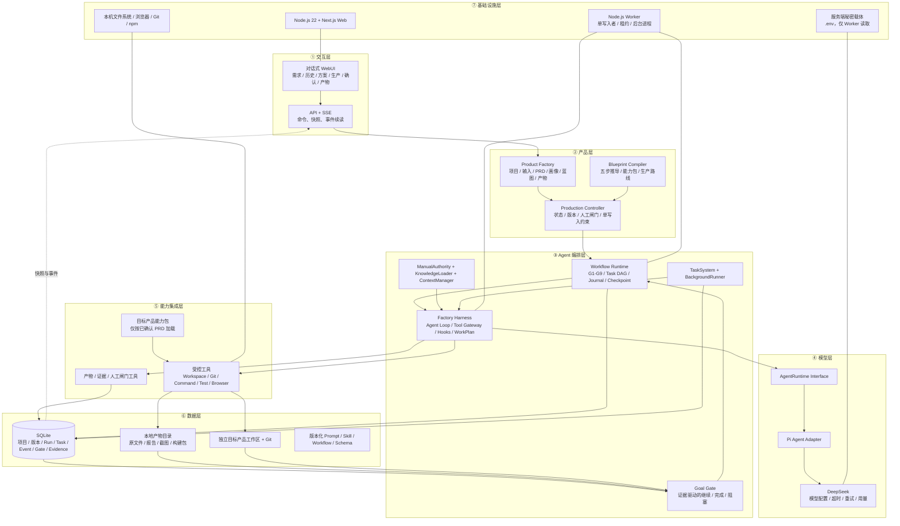

# AI 产品工厂｜七层架构与产品生产蓝图 V1.0

> 文档状态：G5 待产品负责人确认
>
> 已确认输入：`docs/12-AI产品工厂-产品需求文档-PRD.md`、`docs/13-AI产品工厂-技术适配声明.md`、`docs/14-AI产品工厂-Harness五要素领域骨架.md`、`docs/15-AI产品工厂-Agent-Blueprint组件选型表.md`
>
> 规范依据：三份原始手册全文、`agent-blueprint/BLUEPRINT.md` 的 Step 4 架构设计
>
> 当前边界：只确认最终产品方案、七层架构和生产路线；不生成 G6 阶段开发文档，不开放写入型生产工具，不修改生产代码

## 1. G5 产品方案结论

AI 产品工厂第一版确定为：

> 一个本地优先、单用户、对话式 Web 控制台。确定性控制平面负责阶段、状态、权限、预算、检查点和确认；Pi Agent + DeepSeek 驱动的 Factory Harness 在当前生产目标内读取资料、调用受控工具、修改独立目标产品工作区并运行真实验证，最终用可追溯证据形成发布候选。

整体采用**模块化单体、双进程运行**：

- Next.js Web 进程负责用户交互、受控命令和状态查询；
- Node.js Worker 进程负责长时间 Workflow 与 Factory Harness；
- SQLite 保存结构化生产事实、事件、任务、确认和索引；
- 本地受控目录保存原文件、报告、截图和构建包；
- 每个目标产品拥有独立工作区和 Git 历史；
- Web 请求不承载长任务，页面断开不等于任务终止；
- 第一版只有一个产品负责人、一个写入 Worker、一个 Factory Agent；
- 不引入微服务、Redis、PostgreSQL、MCP、Cron、Memory、Subagent 或 Agent Teams。

## 2. 标准七层架构图



### 2.1 横切关注点

两项规则贯穿全部七层，不单独伪装成第八层：

- **安全**：Web 鉴权入口、生产控制器状态权限、Tool Gateway P0–P3 裁决、工作区隔离、秘密保护、人工闸门和发布确认；
- **可观测性**：用户状态、生产事件、Workflow journal、工具轨迹、模型用量、测试报告、浏览器证据和线上监控。

## 3. 七层职责与落地锚点

| 层 | 回答的问题 | 第一版落地锚点 | 明确不做 |
| --- | --- | --- | --- |
| ① 交互层 | 谁在用、怎么控制工厂 | Next.js 对话工作台、历史、待确认、生产状态、产物预览、SSE | 不让前端猜完成；不展示秘密和完整内部思考 |
| ② 产品层 | 产品外壳和生命周期是什么 | ProductFactory、ProductionController、BlueprintCompiler、G1–G9 版本和确认 | 不把游戏或其他目标产品专属逻辑写入控制器 |
| ③ Agent 编排层 | Harness 与固定流程怎样协同 | WorkflowRuntime、FactoryHarness、ToolGateway、ManualAuthority、TaskSystem、GoalGate | 不复制第二套 Loop；不让 Agent 改阶段或自行放行 |
| ④ 模型层 | 智能从哪里来 | AgentRuntime Interface、PiAgent Adapter、DeepSeek 模型档 | 不在页面或业务路由直接调用模型；不硬编码 Key |
| ⑤ 能力集成层 | 怎样触达外部世界 | Workspace、Git、Command、Test、Browser、Artifact、Gate 工具 | 不预装 MCP；不默认访问项目外目录或外部账户 |
| ⑥ 数据层 | 什么必须持久化 | SQLite 生产档案、本地产物索引、目标工作区 Git、版本化定义 | 不把大型二进制塞进 SQLite；不删除重建现有数据库 |
| ⑦ 基础设施层 | 怎样运行和恢复 | Next.js Web、Node Worker、SQLite 队列、SSE、本机浏览器和文件系统 | 当前不公开部署、不引入微服务和外部队列 |

## 4. 控制平面与执行平面

### 4.1 控制平面

控制平面由 WebUI、ProductFactory、ProductionController、BlueprintCompiler 和 WorkflowRuntime 组成，负责：

- 接收用户命令并返回真实快照；
- 管理 G1–G9 和重大影响确认；
- 锁定 PRD、方案、蓝图和生产单版本；
- 限制同一项目第一版最多一个写入中的生产批次；
- 暂停、继续、终止、重试和版本失效；
- 生成生产单、完成目标、预算和工具授权；
- 根据 Goal Gate 和人工决定推进状态。

控制平面不决定阶段内每一次读文件、改代码或运行测试。

### 4.2 执行平面

执行平面由 FactoryHarness、AgentRuntime、ToolGateway、KnowledgeLoader、ContextManager、TaskSystem、BackgroundRunner 和 GoalGate 组成，负责：

- 在当前生产单内驱动一个连续 Agent Loop；
- 完整加载对应手册和最小必要项目知识；
- 建立本轮 WorkPlan，并把复杂工作登记为持久 Task；
- 通过 ToolGateway 执行受控行动；
- 收集 diff、退出码、测试、构建、浏览器和人工证据；
- 在预算、时间、步数和权限内修复失败；
- 证据充分时提交完成，证据不足时继续或交还用户。

执行平面不能自行批准 G1–G9、改变产品范围或执行未经批准的发布。

## 5. 核心深 Module 与 Interface

Interface 是调用方和测试共同使用的契约。下表只保留调用方必须知道的少量能力，复杂 Implementation 留在 Module 内部。

| Module | Interface 能力 | 隐藏的 Implementation | 失败出口 |
| --- | --- | --- | --- |
| ProductionController | 开始、暂停、继续、决定、终止、读取快照 | 阶段转换、并发限制、确认幂等、版本失效和事件追加 | 非法状态拒绝；重大变化进入影响分析 |
| BlueprintCompiler | 根据已确认事实编译、验证蓝图 | 能力包选择、阶段组合、质量闸门和不支持项检查 | 输出结构化缺口，不伪造支持 |
| WorkflowRuntime | 启动、暂停、恢复、终止、接收生命周期事件 | 定义注册、Task DAG、journal、稳定调用键和检查点 | 阻塞、失败、取消或等待人工决定 |
| FactoryHarness | 执行或恢复一个完成目标，输出统一事件 | Pi Agent Loop、上下文、工具回传、退出原因、轮数和预算 | 完成、失败、阻塞、取消或等待用户 |
| AgentRuntime | 运行、steer、abort | Pi 事件格式、DeepSeek 流式调用和供应商细节 | 统一模型错误和终态 |
| ToolGateway | 执行一个结构化工具请求 | 注册、schema、路径、权限、Hooks、超时、错误和审计 | allowed / approval_required / denied / failed |
| ManualAuthority | 校验并按阶段加载手册 | 文件定位、SHA、稳定顺序、受保护上下文和加载记录 | 缺失或哈希不符立即阻塞 |
| TaskSystem | 创建、认领、更新和恢复持久任务 | 依赖、租约、幂等、检查点和并发控制 | blocked / failed / retryable |
| BackgroundRunner | 启动、查询、取消慢任务 | 进程管理、输出截断、超时、通知和清理 | 完成或失败通知回到原生产记录 |
| GoalGate | 用完成目标与证据评估终态 | 证据完整性、限制条件、不可能状态和人工依赖 | continue / complete / failed / waiting_user |
| ProductionRecord | 追加事实、读取快照、登记产物和证据 | SQLite 事务、投影、迁移、序号和文件索引 | 数据错误阻塞，不静默丢弃 |

### 5.1 真实 Seam 与 Adapter

- `AgentRuntime` 是真实 Seam：生产使用 PiAgent Adapter，测试使用 InMemory Adapter；
- ProductionRecord 的 SQLite 与测试数据库构成内部可替代依赖，不把 SQL 泄露给调用方；
- 文件、Git、命令和浏览器在 ToolGateway 内使用生产 Adapter 与临时工作区测试 Adapter；
- DeepSeek 是不可控外部依赖，通过 AgentRuntime Seam 归一化超时、限流、错误和用量；
- 第一版没有自有远程微服务，因此不创建假想网络端口。

## 6. 端到端数据流

```text
用户输入一句需求 / PRD / 文档
→ WebUI 创建产品项目并登记原始输入
→ Blueprint 流程依次生成 G1–G5 产物
→ 用户对真实产物逐步确认
→ G5 通过后生成 G6 当前阶段开发文档、生产单和完成目标
→ G6 通过后 ProductionController 开放当前阶段写入权限
→ WorkflowRuntime 创建持久 Task 和 journal
→ FactoryHarness 加载 ManualAuthority、已确认产物和当前工作区
→ Pi Agent + DeepSeek 根据工具观察决定下一步普通行动
→ ToolGateway 校验权限并执行文件 / Git / 命令 / 测试 / 浏览器工具
→ 结果、diff、报告、截图和用量登记为事件、产物和证据
→ GoalGate 判断继续修复、完成、阻塞或等待用户
→ 自动质量通过后，产品负责人真实操作并完成 G7
→ 按目标产品需要完成正式终端并进入 G8
→ 生成部署、费用、凭证和回滚方案，G9 确认后才正式上线
```

## 7. 产品生产蓝图

### 7.1 蓝图身份

每个目标产品的 Production Blueprint 必须包含：

- `blueprintId`、版本、产品项目和生成时间；
- 输入 PRD 版本、G2–G5 上游产物版本；
- 产品画像、五要素、组件选型和能力包；
- 目标终端、交付物、明确不做和不支持项；
- 阶段、工位、Task 依赖、质量闸门和人工闸门；
- 工具授权、风险等级和重大影响策略；
- 完成目标、预期产物、证据类型和失败出口；
- 模型档、预算引用、Workflow Definition 版本；
- 上游变化后的失效范围。

蓝图一旦启动生产，不因模板或代码后来更新而悄悄改变。需要变化时生成新版本，并保留旧版本和确认记录。

### 7.2 G1–G9 主链路

```mermaid
flowchart LR
    INPUT["输入与原文登记"] --> PRD["标准 PRD"] --> G1{"G1 PRD"}
    G1 --> ADAPT["技术适配"] --> G2{"G2 适配"}
    G2 --> DOMAIN["五要素"] --> G3{"G3 领域"}
    G3 --> SELECT["组件与能力包"] --> G4{"G4 选型"}
    G4 --> ARCH["七层架构与蓝图"] --> G5{"G5 方案"}
    G5 --> STAGE["当前阶段开发文档\n生产单 / 完成目标 / 预算"] --> G6{"G6 开工"}
    G6 --> BUILD["Factory Agent 受控生产"] --> AUTO["自动质量与 Goal Gate"] --> G7{"G7 真实效果"}
    G7 --> FRONT["正式终端 / 前端"] --> G8{"G8 终端体验"}
    G8 --> DEPLOY["部署 / 费用 / 凭证 / 回滚方案"] --> G9{"G9 发布"}
    G9 --> RELEASE["正式部署与线上验收"]

    G1 -.退回.-> PRD
    G2 -.退回.-> ADAPT
    G3 -.退回.-> DOMAIN
    G4 -.退回.-> SELECT
    G5 -.退回.-> ARCH
    G6 -.退回.-> STAGE
    G7 -.修复.-> BUILD
    G8 -.修复.-> FRONT
    G9 -.修改方案.-> DEPLOY
```



所有固定闸门都保存决定。目标产品不需要 Web 前端时，G8 仍确认它的目标终端体验或明确的“不适用”产物，不能静默跳过确认记录。

### 7.3 通用基础工位与依赖

| 顺序 | 工位 | 依赖 | 主要产物 | 质量或人工闸门 |
| --- | --- | --- | --- | --- |
| 1 | 接单与资料体检 | 原始输入 | 输入索引、缺失项、冲突和支持范围 | QG-01 输入完整性 |
| 2 | 产品范围与 PRD | 体检通过 | 标准 PRD、核心闭环、明确不做 | G1 |
| 3 | 技术适配 | G1 | 技术适配声明、开发路径 | G2 |
| 4 | 领域建模 | G2 | 工具、知识、观察、行动、权限 | G3 |
| 5 | 组件与能力包选型 | G3 | 采用、暂缓、不采用及依据 | G4 |
| 6 | 架构与蓝图 | G4 | 七层架构、生产蓝图、工具与安全方案 | G5 |
| 7 | 当前阶段设计 | G5 | 阶段开发文档、生产单、完成目标和预算 | G6 |
| 8 | 核心生产 | G6 | 真实代码、文档、测试和最小交互 | QG-02、QG-03、QG-06 |
| 9 | 自动质量与修复 | 核心产物 | Lint、类型、测试、构建、真实模型或浏览器证据 | Goal Gate |
| 10 | 产品效果验收 | 自动质量通过 | 可运行产品、效果报告、成本和已知问题 | G7 |
| 11 | 正式终端生产 | G7 且目标需要 | 正式前端或目标终端产物 | QG-04、G8 |
| 12 | 综合质量与发布准备 | G8 | 发布候选、部署和回滚方案 | QG-05、G9 |
| 13 | 部署与线上验收 | G9 | 访问地址、登录、监控和恢复证据 | 线上验收记录 |

生产蓝图可以按产品事实增加专用工位或把相邻执行工位合并展示，但不能删除对应的安全、真实性、恢复和确认责任。

### 7.4 Task DAG 规则

- G1–G6 严格依赖前一确认版本；
- 进入写入型生产前必须存在 G6、生产单、完成目标和工作区授权；
- 修改代码依赖工作区体检和 Git 未提交状态证据；
- 测试依赖对应变更完成；构建依赖阻断测试通过；
- 浏览器验收依赖可运行构建和真实接口；
- 发布候选依赖所需自动质量、真实效果、正式终端和全部确认；
- 正式部署依赖 G9，不得由 Goal Gate 自动触发；
- 无依赖的只读任务可以并行观察，但第一版同一工作区只有一个写入任务；
- 失败任务保留证据并创建修复任务，不覆盖原记录；
- 恢复使用稳定调用键，已完成副作用不重复执行。

## 8. 工具清单

下表是架构级工具合同；具体 schema、命令策略、超时和错误码在 G6 当前阶段开发文档中冻结。

| 工具 | 主要输入 | 主要输出 | 副作用 | 权限 | 所属层 |
| --- | --- | --- | --- | --- | --- |
| `manual.verify` | 手册清单与期望哈希 | 每份校验结果 | 无 | P0，只读；失败阻塞 | ③ / ⑥ |
| `manual.load` | 当前阶段 | 受保护原文上下文与加载记录 | 模型上下文增加 | P0；不得公开或摘要替代 | ③ |
| `workspace.list` | 项目、受控路径 | 文件和元数据 | 无 | P0，限目标工作区 | ⑤ |
| `workspace.read` | 项目、相对路径、范围 | 文件内容与哈希 | 无 | P0，限目标工作区 | ⑤ |
| `workspace.search` | 项目、查询和范围 | 匹配位置与片段 | 无 | P0，限目标工作区 | ⑤ |
| `workspace.patch` | 项目、相对路径、补丁 | 变更结果和新哈希 | 修改文件 | G6 后 P1；越界拒绝 | ⑤ |
| `git.inspect` | 工作区、查询类型 | status、diff、log 等 | 无 | P0，只读 | ⑤ |
| `git.commit` | 已验证变更与说明 | 本地提交 ID | 写本地历史 | G6 后 P1；不覆盖用户历史 | ⑤ |
| `command.run` | 结构化命令、工作目录、超时 | 退出码、输出、错误、耗时 | 可能修改文件或启动进程 | 策略裁决；危险动作 P2/P3 | ⑤ |
| `test.run` | 测试类型、范围和配置 | 报告、退出码、失败项 | 生成缓存和报告 | P1 | ⑤ |
| `build.run` | 构建目标与配置 | 构建结果和产物 | 生成构建目录 | P1 | ⑤ |
| `browser.inspect` | 地址、步骤、尺寸 | 页面、Console、Network、截图 | 可能创建测试数据 | 本地/测试 P1；外部提交按风险 | ⑤ |
| `workplan.update` | 当前计划与状态 | 用户可见计划 | 更新本轮计划 | P1；不能改生产阶段 | ③ |
| `task.manage` | 任务、依赖和状态动作 | Task 快照 | 写持久任务事实 | 由 Workflow 授权 | ③ / ⑥ |
| `background.manage` | 慢任务和控制动作 | 任务 ID、状态、完成通知 | 启停后台进程 | P1；危险命令仍按 ToolGateway 裁决 | ③ / ⑦ |
| `artifact.register` | 文件、类型、来源和哈希 | Artifact ID 与版本 | 写档案索引 | P1；原文件不可被覆盖 | ⑤ / ⑥ |
| `evidence.register` | 完成目标、观察和产物引用 | Evidence ID | 写质量证据 | P1；失败证据不可删除 | ⑤ / ⑥ |
| `gate.request` | 类型、版本、原因、选项和影响 | 待确认 Gate | 暂停后续流程 | 允许请求；批准仅产品负责人 | ② / ⑤ |
| `stage.report` | 生产单、结果、产物、检查和问题 | 工位报告 | 写生产档案 | P1；不能直接放行 | ② / ⑥ |
| `git.push` / `release.deploy` | 目标远程或环境、候选版本 | 远程回执、地址 | 对外可见、可能计费 | P2，必须独立确认 | ⑤ / ⑦ |

## 9. 系统提示词草案

系统提示词作为版本化产物管理，不硬编码在 Worker 路由中。G5 只冻结结构，具体文本和输出 schema 在 G6 完成。

```text
身份：你是 AI 产品工厂的 Factory Agent，在确定性生产控制器管理的当前生产单内工作。

权威顺序：
1. 当前阶段所需的三份原始手册全文；
2. 已确认 PRD；
3. 已确认上游产物；
4. 当前生产单、完成目标、工具授权与预算；
5. 目标工作区的真实代码、测试和文档。

行动规则：
- 先检查事实，再制定或更新 WorkPlan；
- 普通行动只能通过已注册工具请求；
- 工具失败后读取真实结果，在预算内修复或升级；
- 不得越过工作区、权限、阶段或人工闸门；
- 不得读取、输出或保存秘密；
- 不得删除测试、隐藏错误或用 mock 冒充真实验收；
- 三份手册不得被摘要替代或在上下文压缩中丢失。

完成规则：
- 模型停止、文字声明或页面等待时间不代表完成；
- 提交的每项结论必须引用已登记产物和证据；
- 证据不足时继续、阻塞或请求用户决定；
- 达到预算、时间、轮数或能力限制时如实交还控制权。

输出：使用工位报告 schema，列出产物、变更、检查、假设、已知问题和推荐下一步。
```

## 10. 上下文与记忆策略

### 10.1 当前上下文组成

1. ManualAuthority 校验并加载当前阶段的原始手册；
2. 加载已确认 PRD 与当前有效上游产物；
3. 加载生产单、完成目标、Workflow 与 Task 快照；
4. 加载当前目标需要的 Skill 目录和最小必要正文；
5. 读取工作区真实文件、测试和最近观察；
6. 注入工具说明、权限、预算和工位报告 schema。

### 10.2 压缩规则

- 优先把旧的大型工具结果转存为产物并保留引用；
- 保留最近观察、未完成目标、工具调用/结果配对和检查点；
- 普通聊天历史可以摘要；
- 三份手册、当前生产单、完成目标、重大决定和未解决错误不得被摘要替代；
- 压缩前后记录 Token 和缓存指标；
- 恢复时从持久事实重建，不依赖进程内对话数组。

### 10.3 Memory 结论

V0.2 不启用跨项目 Memory。项目内需要保留的事实进入 Production Record、已确认产物和版本化配置。以后确有跨项目偏好需求时重新走 G4，不把聊天历史自动当成长期记忆。

## 11. 数据与版本设计

### 11.1 SQLite 保存

- 产品项目、原始输入索引和产品画像；
- PRD、技术适配、领域骨架、组件选型、生产蓝图和阶段文档版本元数据；
- G1–G9 和重大影响确认；
- 生产批次、生产单、Workflow run、journal、Task、租约和检查点；
- Tool request/result、生产事件、模型用量、错误和通知；
- Artifact 与 Evidence 元数据及关联；
- 发布候选和部署回执索引。

### 11.2 文件系统保存

- 用户上传的原始 PRD 文件；
- 生成的 Markdown、DOCX、PDF 或其他文档；
- 测试报告、截图、录屏、构建包和大日志；
- 版本化 Prompt、Skill、Workflow 和 schema；
- 每个目标产品的独立工作区和 Git 仓库。

每个文件记录受控路径、原始名称、内容类型、大小、哈希、状态、时间和项目归属。SQLite schema 变化必须通过编号、事务化迁移兼容现有数据，不允许删除重建 `data/factory.sqlite`。

### 11.3 版本失效

- 修改输入但不影响产品目标时，只重新生成直接受影响产物；
- 修改目标、终端、外部系统、费用或交付范围时，先生成影响分析；
- 下游产物和确认按依赖失效，不无理由全部推倒重来；
- 旧版本、旧确认和失败证据保留，不能覆盖；
- 已开始的生产批次继续绑定启动时蓝图，除非产品负责人明确终止并迁移。

## 12. 状态模型

### 12.1 方案状态

```text
collecting_input
→ drafting_prd → waiting_prd_approval
→ adapting → waiting_adaptation_approval
→ modeling_domain → waiting_domain_approval
→ selecting_components → waiting_component_approval
→ designing_architecture → waiting_blueprint_approval
→ planning_stage → waiting_stage_approval
→ ready_for_production
```

### 12.2 生产批次状态

```text
ready
→ running ↔ paused
→ waiting_input | waiting_approval
→ verifying
→ succeeded

任意运行态 → failed | cancelled
failed → ready_for_retry
```

### 12.3 任务状态

```text
pending → in_progress → completed
             ↘ blocked
             ↘ failed → ready_for_retry
             ↘ cancelled
```

页面只显示 ProductionController 返回的事实状态。SSE 断开、Agent 停止输出、动画结束和页面等待时间都不能改变终态。

## 13. 人工闸门与质量闸门

### 13.1 人工闸门

| 闸门 | 确认对象 | 通过后开放 |
| --- | --- | --- |
| G1 | PRD、目标、范围和核心闭环 | 技术适配 |
| G2 | 技术基线、按需项和偏离 | 领域建模 |
| G3 | 工具、知识、观察、行动和权限 | 组件选型 |
| G4 | 采用、暂缓和不采用 | 七层架构与蓝图 |
| G5 | 最终产品方案、路线和明确不做 | 当前阶段开发文档 |
| G6 | 阶段范围、完成目标、预算和验收 | 当前阶段写入工具 |
| G7 | 可运行产品和真实效果 | 正式终端或下一阶段 |
| G8 | 正式界面或目标终端体验 | 部署准备 |
| G9 | 部署、费用、凭证和回滚 | 正式上线 |

任何阶段出现新增费用、敏感数据、破坏性操作、外部发送或重大范围变化，额外触发 `major_impact`，不替代 G1–G9。

### 13.2 固定质量闸门

| 质量闸门 | 最低证据 |
| --- | --- |
| QG-01 输入完整性 | 原始输入、来源、缺失和冲突可追溯 |
| QG-02 变更安全 | 授权工作区、Git 状态、秘密保护和权限记录 |
| QG-03 核心能力 | 自动测试、真实输入产物、恢复和错误路径；涉及模型时真实冒烟 |
| QG-04 正式终端 | 真实接口、状态矩阵、刷新恢复、移动端和核心 E2E |
| QG-05 发布候选 | Lint、类型、测试、构建、浏览器、已知问题和回退 |
| QG-06 完成目标 | Goal Gate 与主 Agent 分离，结论引用真实证据，后台任务已终止 |

自动质量不能替代产品负责人对游戏可玩性、Agent 输出质量、视觉体验或业务准确性的 G7/G8 判断。

## 14. 安全与权限架构

- Key 和部署凭证只保存在服务端秘密载体，不进入前端、数据库事件、日志、截图、模型消息或 Git；
- ManualAuthority 原文只从内部路径读取，不进入公开仓库；
- 用户上传内容、网页和代码注释都作为不可信数据，不能覆盖手册、系统规则或权限；
- 所有相对路径解析到目标工作区后再次校验，越界直接拒绝；
- Shell 使用结构化命令策略、工作目录、超时和风险分级，不依赖字符串黑名单；
- 普通 P0/P1 动作自动执行并审计；P2 在执行前展示影响、费用和恢复方式；P3 永久拒绝；
- 同一项目第一版只允许一个写入中的生产批次；
- 恢复前检查稳定调用键和副作用记录，避免重复发布、扣费、删除或消息；
- Git push、创建远程仓库、外部发送、付费资源和正式部署必须人工确认；
- WebUI 隐藏按钮不构成权限，最终裁决全部在 ToolGateway 和 ProductionController；
- 日志只记录必要元数据，完整用户文档和秘密不进入结构化日志。

## 15. 失败与降级方案

| 失败 | 系统行为 | 用户看到什么 | 禁止行为 |
| --- | --- | --- | --- |
| 手册缺失或哈希失败 | 生产立即 blocked | 缺失或失败的手册名称及修复方式 | 用摘要、旧副本或公开文档继续 |
| DeepSeek 未配置 | 保留任务和事件，进入 blocked | “需要配置模型后继续” | 显示仍在生成或假结果 |
| DeepSeek 超时、限流或失败 | 有限重试，仍失败则 failed / retryable | 真实原因和重新开始入口 | 无限重试和无限费用 |
| 模型输出空或结构错误 | 不创建人工闸门；失败或有限重试 | “没有生成可确认结果” | 等待久后自动弹确认 |
| 权限拒绝 | ToolResult=denied，保留审计 | 被拒动作、原因和安全替代 | Agent 自行换方式绕过 |
| 工具或测试失败 | 保存失败证据，创建修复任务 | 失败项、已保留结果和下一步 | 删除测试或隐藏错误 |
| 后台任务失败 | 通知原 Task，释放依赖或阻塞 | 哪项失败、是否可重试 | 永远显示 running |
| Worker 崩溃 | 租约回收，从 journal/checkpoint 恢复 | “已恢复到上次安全位置” | 从头重复全部副作用 |
| SSE 或页面断开 | 后端继续；重连后读取事件序号和快照 | “连接恢复中，任务未必停止” | 创建第二个相同任务 |
| 证据不足 | GoalGate=continue 或 waiting_user | 还缺什么证据、推荐动作 | 接受 Agent 自评为完成 |
| PRD 重大变化 | 影响分析并使相关下游版本失效 | 哪些阶段需要重新确认 | 悄悄改动正在运行蓝图 |
| 暂不支持的产品能力 | 蓝图列出 unsupported capability | 缺口和推荐路线 | 伪造支持或生成不可运行代码 |
| 发布未确认 | 停在 release candidate | 候选版本和待确认发布方案 | Git push 或正式部署 |

## 16. 可观测性设计

### 16.1 用户默认可见

- 当前产品、重大阶段和真实状态；
- 当前目标、WorkPlan、已完成事项和下一步；
- 需要用户决定的内容、推荐项和影响；
- 产物预览、错误、恢复入口和真实耗时；
- 简化的模型和费用摘要；
- 最近必要运行记录，固定高度内滚动。

### 16.2 默认收起的运行详情

- 生产批次、Workflow、Task、工具和事件 ID；
- 工具名、脱敏参数摘要、开始结束时间、结果和错误；
- 模型、首字时间、总耗时、Token、缓存、成本和重试；
- 测试、构建、浏览器、Console、Network 和截图证据；
- 权限裁决、人工决定、质量结论和检查点；
- Prompt、Skill、Workflow、schema 和手册哈希版本。

### 16.3 必须采集的指标

- G1–G6 每阶段生成时间、等待确认时间和退回次数；
- Worker 队列、领取、租约、恢复和重复副作用拦截；
- 每个工具成功率、失败类型、超时和权限拒绝；
- DeepSeek 首字时间、总耗时、Token、缓存命中、成本和结构首测合规率；
- Goal Gate 继续、通过、阻塞和失败原因；
- 自动测试、构建、浏览器 E2E 和真实效果通过率；
- 从 PRD 到发布候选的总时间和人工确认次数。

## 17. 技术栈与部署形态

| 位置 | 第一版方案 |
| --- | --- |
| WebUI | Next.js 16.3.1、React 19.2.8、TypeScript 5.9.3、Tailwind CSS 4.3.3 |
| Worker | Node.js 22、TypeScript、独立长任务进程 |
| Agent | `@earendil-works/pi-agent-core@0.84.2`，经 AgentRuntime Interface |
| 模型 | `@earendil-works/pi-ai@0.84.2` + DeepSeek，配置化模型档 |
| Schema | Zod 4.4.3 + TypeScript |
| 数据 | SQLite + `better-sqlite3`、WAL、事务、外键和版本化迁移 |
| 进程通信 | SQLite 持久任务和事件 + SSE 观察 |
| 测试 | Vitest、TypeScript、ESLint、Next build；阶段加入 Playwright |
| 产物 | 本地产物目录 + SQLite 元数据；目标产品独立工作区 + Git |
| 秘密 | 根目录本地 `.env`，只由 Worker 读取；不提交、不回显 |

当前部署形态是**本机模块化单体**。G5 不创建云资源、不安装部署 CLI、不登录第三方平台，也不产生新增部署费用。

未来只有在工厂核心能力、正式 WebUI 和 G8 都通过后，才完整应用上线部署手册，生成费用、登录、数据、文件、监控和回滚方案并进入 G9。目标产品的部署路线根据各自 PRD 决定，不因工厂使用 WebUI 就强迫所有产品部署到同一平台。

## 18. 当前工厂实施路线

### 阶段 A：V0.2-A PRD 与逐步确认

当前结果：G1–G4 已确认，G5 本文件待确认。

- 三种输入和原文保留；
- 标准 PRD 与 G1；
- 技术适配、领域骨架、组件选型和架构分步产物；
- 版本、确认和空结果保护。

### 阶段 B：V0.2-B 最小可执行 Harness

G5 通过后的**第一份 G6 开发文档只覆盖本阶段**：

- FactoryHarness 单一 Agent Loop；
- ToolGateway、Hooks 和 P0–P3 权限；
- ManualAuthority 与受保护上下文；
- 工作区读、写、搜索；
- Git 检查、受控命令和测试；
- WorkPlan、工具调用/结果配对、产物和证据登记；
- 用独立测试工作区跑通“读取 → 修改 → 测试失败 → 修复 → 复测”。

阶段 B 明确不做完整 Workflow 恢复、Agent Teams、正式目标产品生产或部署。

### 阶段 C：V0.2-C Workflow、恢复与质量

- WorkflowRuntime、Task DAG、journal、租约和检查点；
- 暂停、继续、终止、后台任务和崩溃恢复；
- GoalGate 与 QG-01–QG-06；
- G6–G7 完整闭环和修复生产单；
- WebUI 展示计划、工具、证据和恢复。

### 阶段 D：V0.2-D 小游戏试产

- 接入用户后续提供的小游戏 PRD；
- 在独立工作区生产可运行小游戏；
- 至少经历一次失败、修复和恢复；
- 浏览器真实试玩、移动端检查和 G7；
- 按游戏 PRD 完成正式终端与发布候选；
- 未经 G9 不部署。

### 阶段 E：V0.2-E 通用性验证

- 选择与小游戏明显不同的产品画像；
- 共用 ProductionController、WorkflowRuntime 和 ProductionRecord；
- 只组合该产品需要的能力包；
- 核心状态和数据中不出现游戏专属字段；
- 用真实数据决定是否重新评估 Subagent、Memory、Teams、MCP 或 Cron。

只有阶段 D 与 E 都形成证据，才可以声称“通用 AI 产品工厂 MVP 成立”。

## 19. 明确不做

G5 确认不会授权以下事项：

- 不修改生产代码；
- 不提前生成阶段 B–E 的全部开发文档；
- 不迁移 Python/FastAPI，不升级现有核心依赖；
- 不删除、覆盖或重建现有 SQLite 数据；
- 不清理工作区现有未提交修改；
- 不创建第二套 Agent Loop、平行临时 WebUI 或微服务；
- 不启用 Subagent、Memory、Agent Teams、Cron 或 MCP；
- 不引入 RAG、多媒体、账户多租户或实时通信；
- 不猜测小游戏玩法、框架、资产或部署平台；
- 不公开三份原始手册；
- 不创建云资源、Git 远程推送或正式部署。

## 20. 当前已知缺口

本文件是目标架构与生产蓝图，不表示现有代码已经实现：

- 当前 Worker 仍主要是一张生产单对应一次模型生成；
- AgentRuntime 尚未接入完整工具、steer、abort、预算和上下文恢复；
- G1–G9 结构化产物和版本失效尚未完整持久化；
- ToolGateway、ManualAuthority、TaskSystem、BackgroundRunner 和 GoalGate 尚未完成；
- SQLite 需要编号迁移而不是继续零散 `ALTER TABLE`；
- 文件上传、DOCX/PDF 解析和安全校验尚未完成；
- WebUI 尚未完整显示 WorkPlan、工具、证据、暂停和恢复；
- Playwright 与真实产品试产证据尚未形成；
- 公开部署、登录、对象存储、备份和监控尚未开始。

这些缺口必须进入对应 G6 开发文档、测试和验收，不能因架构文档存在而标记为完成。

## 21. G5 追踪依据

| 方案结论 | 依据 |
| --- | --- |
| 七层架构必须完整表达并带贯穿数据流 | Agent Blueprint Step 4 |
| 模块化单体、本地优先、Node/TypeScript/SQLite | 已确认 G2 |
| 工具、知识、观察、行动和 P0–P3 | 已确认 G3 |
| 采用 12 项、暂缓 3 项、不采用 2 项 | 已确认 G4 |
| G1–G9 和重大影响确认 | 已确认 PRD 7–8 节 |
| 长任务可恢复、动态工具受控、模型输出校验 | 通用技术栈手册强制底线 |
| WebUI 状态、断线恢复、真实浏览器和移动端 | 前端技术栈手册强制底线 |
| 正式上线前登录、数据、文件、监控和费用确认 | 上线部署手册强制底线 |
| 小游戏只是第一台试产，第二台验证通用性 | 已确认 PRD 与产品定义 |

## 22. 需要产品负责人决定的问题

**无新增产品决定。**

本方案没有新增供应商、付费服务、公开部署、多用户、外部数据系统或目标产品范围。G5 通过后，下一步只生成阶段 B“最小可执行 Harness”的 G6 当前阶段开发文档；届时再给出具体工具 schema、预算、时间、步数和验收清单。

## 23. G5 确认清单

产品负责人只需确认：

- [ ] 最终产品是“Web 控制平面 + 确定性 Workflow + 单 Factory Agent Harness”的本地优先产品工厂；
- [ ] 七层架构、控制平面和执行平面的职责没有理解偏差；
- [ ] G1–G9、生产任务、工具、证据和发布路线符合逐步确认要求；
- [ ] 普通操作自动执行，删除、费用、外部发送、Git push 和发布继续需要确认；
- [ ] 第一版继续使用 Node.js、TypeScript、Next.js、SQLite、Pi Agent 和 DeepSeek，不新增外部平台；
- [ ] 先建设最小可执行 Harness，再建设恢复与 Goal Gate，然后小游戏试产和非游戏验证；
- [ ] Subagent、Memory、Teams、Cron、MCP、多用户和公开部署继续不进入当前范围；
- [ ] 当前代码缺口仍需 G6 后真实开发和双层验收，不能把本文档当成已经实现。

全部确认后，本文档状态改为“G5 已确认”，下一步只生成 G6《第一阶段技术开发文档｜最小可执行 Harness》，不提前修改生产代码。
