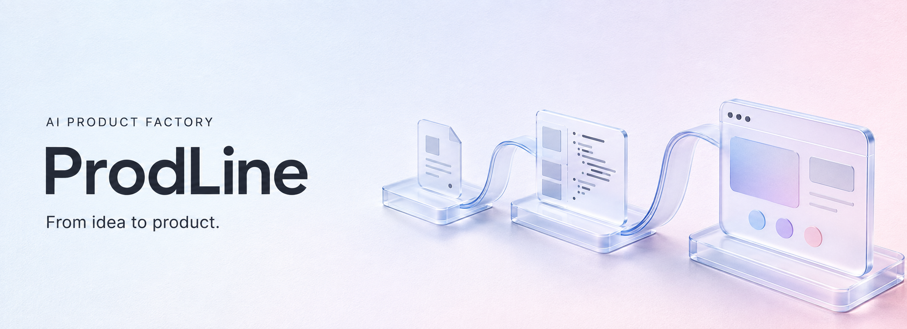

<p align="center">
  
</p>

<h1 align="center">ProdLine · AI 产品工厂</h1>

<p align="center">
  从一句需求开始，在对话中完成分析、生产与验收。<br>
  一个本地优先、由 Codex App Server 驱动的产品生产工作台。
</p>

<p align="center">
  
  
  
</p>

<p align="center">
  <a href="#工作流程">工作流程</a> ·
  <a href="#核心能力">核心能力</a> ·
  <a href="#本地运行">本地运行</a> ·
  <a href="#当前边界">当前边界</a> ·
  <a href="#文档导航">文档导航</a>
</p>

---

## 产品介绍

ProdLine 把分散的需求分析、技术方案、代码生产、测试和交付准备，组织成一条可追踪的产品生产流程。

你可以输入一段想法，或粘贴已有 PRD。发送后开始分析；每一阶段的结果、运行记录、修改意见和确认操作，都保留在同一条对话中。**先看结果，再决定修改或继续。**

它面向不同类型的数字产品，不限于小游戏；被生产的产品也不必自带 AI。具体生产能力由产品画像、能力包和实际配置的工具共同决定。

## 工作流程

| 阶段 | 在工作台里做什么 |
| :--- | :--- |
| **01 · 明确需求** | 输入需求或 PRD，查看分析结果，补充问题并确认范围。 |
| **02 · 确定方案** | 检查技术适配与开发计划，逐步确认后进入生产。 |
| **03 · 制作产品** | Codex 在受控工具权限下执行，查看文档、代码和可预览产物。 |
| **04 · 检查与验收** | 查看自动检查证据与实际结果；不通过时提交修改，返工后再检查。 |
| **05 · 准备交付** | 生成上线方案、检查上线材料、整理手工发布清单，停在待人工发布。 |

> 修改意见不会被当作确认。结果未完成或检查未通过时，不应直接放行；上线流程不替你执行真实发布。

## 核心能力

- **对话式工作台** — 需求、结果、反馈、确认与记录集中展示；从左侧历史回到已有产品。
- **可控制的生产过程** — 查看进度、发送补充、停止任务；在允许的状态下重试或从记录恢复。
- **有证据的质量检查** — 结合静态检查与隔离浏览器冒烟；失败可以返工，不能靠 Agent 的完成声明放行。
- **Codex 统一执行** — 普通生产阶段与 Harness 使用 Codex App Server，Web 不直接调用模型处理长任务。
- **可组合的素材工位** — 为图片、音频和 3D 定义生产与验收接口；Codex 负责调用，真实工具负责产出。
- **本地生产档案** — SQLite 保存产品、生产批次、事件与确认状态；产物访问受隔离与删除状态检查约束。

## 本地运行

### 运行前准备

- **Node.js 22+** 与 npm。
- **本机 Codex CLI**，以及可用的本机 Codex 账户会话。WebUI 不设登录或退出入口，也不要求填写模型 API Key。
- **Chrome**，供产品自动检查使用；未安装或不可用时，浏览器检查不会自动放行。
- **三份内部原始手册**，仅在授权工作区提供，用于启动真实产品生产流程。

> **公开仓库不包含三份原始手册。** 未取得原文时，可阅读代码与项目文档，但不能把它当作已具备完整生产条件的开箱即用版本。摘要不能替代原文，原文也不应提交到公开仓库。

### 启动工作台

```bash
git clone https://github.com/LECoO21/ai-product-factory.git
cd ai-product-factory/AI产品工厂

npm ci
# 仅首次创建；已有 .env 时不要覆盖
cp -n .env.example .env

npm run dev
```

打开终端显示的地址，默认是 **http://localhost:3000**。如果你在功能开发分支上试用，请先切换到对应分支。

默认从 `PATH` 启动 `codex app-server`；只有找不到 Codex 时，才需要在 `.env` 设置 `CODEX_BINARY`。`CODEX_MODEL` 留空时使用本机 Codex 配置。

开发服务默认仅监听 `127.0.0.1`。**当前个人无登录版本不应暴露到公网。** 本地数据库默认位于 `AI产品工厂/data/factory.sqlite`；`.env`、数据库与开发缓存不纳入版本管理。

更多配置见 [工程使用说明](./AI产品工厂/README.md#本地运行) 与 [环境变量示例](./AI产品工厂/.env.example)。

## 架构与技术栈

**Web 负责交互，Worker 负责执行，运行内核负责状态与确认。**

| 模块 | 职责与实现 |
| :--- | :--- |
| Web 控制台 | Next.js、React、TypeScript；页面、API 与 SSE 实时事件。 |
| 生产 Worker | 领取生产批次，通过 Codex App Server 执行并持久化结果。 |
| Runtime Core / Harness | 确定性状态流转、工具权限、人工确认与质量闸门。 |
| 生产档案 | SQLite；命令队列、事件、检查点和手册快照。 |
| 工程验证 | Vitest、React Testing Library、Playwright。 |

<details>
<summary>展开项目结构</summary>

```text
AI产品工厂/
├── apps/
│   ├── web/             # 对话式控制台、API、SSE
│   └── worker/          # 生产执行与素材、质量、交付工位
├── packages/
│   ├── agent-runtime/   # Codex App Server 协议与运行适配
│   ├── runtime-core/    # 确定性运行核心
│   ├── harness/         # 受控工具与完成校验
│   ├── production/      # 产品生产工作流
│   ├── blueprints/      # 产品画像、生产蓝图与能力包
│   ├── records/         # SQLite 档案与迁移
│   ├── protocol/        # 运行协议与事件
│   └── shared/          # 共享类型与能力定义
└── docs/                # PRD、架构、规范与验收记录
```

</details>

## 当前边界

ProdLine 正在持续开发，当前是**本地优先、个人使用**的产品工厂，不是已完成多租户隔离的云端 SaaS。

- **不自动上线**：只准备发布候选与手工发布材料，不创建云资源、不写正式 Secret、不执行部署。
- **不承诺所有素材即刻可用**：图片、音频、3D 依赖真实工具配置；未配置就明确阻塞，不返回假素材。
- **不把冒烟当完整验收**：浏览器抽查不等于覆盖全部 PRD、多端或独立后端；相关能力仍需独立验证。
- **不混用历史证据**：旧 Pi / DeepSeek 验收记录仅作历史基线。Codex 真实 Turn 与真实素材生产仍需独立冒烟验证，不能用单元测试代替。

## 开发检查

以下命令均在 `AI产品工厂/` 中运行。`manuals:verify` 需要内部原文；E2E 需要相应浏览器环境。

```bash
npm run manuals:verify
npm run lint
npm run typecheck
npm test
npm run test:e2e
npm run build
```

生产构建不等于部署。发布候选打包与历史验收说明见 [工程 README](./AI产品工厂/README.md)。

## 文档导航

| 从这里开始 | 说明 |
| :--- | :--- |
| [工程使用说明](./AI产品工厂/README.md) | 详细配置、功能状态、操作步骤与历史文档索引。 |
| [产品需求文档](./AI产品工厂/docs/12-AI产品工厂-产品需求文档-PRD.md) | 产品目标、生产流程与验收要求。 |
| [Codex App Server 架构](./AI产品工厂/docs/28-Codex-App-Server架构迁移技术适配声明.md) | 当前运行底座、执行边界与迁移约定。 |
| [领域语言](./AI产品工厂/CONTEXT.md) | 产品项目、生产批次、工位、产物与质量证据。 |
| [ProdLine 视觉与修复记录](./AI产品工厂/docs/30-ProdLine视觉规范与高优先级修复.md) | 当前视觉规范与高优先级问题处理记录。 |
| [三份手册执行宪章](./AI产品工厂/docs/00-三份手册执行宪章.md) | 原文权威性、完整快照与隐私约束，不包含手册原文。 |

---

<p align="center">
  <strong>ProdLine</strong><br>
  让每一步生产，都有结果可看、有依据可确认。
</p>
